# Lab 01 - Getting started with Powerapps

## Estimated Duration: 45 minutes

Working as part of the Prioritz fusion team you will be setting up your Power Platform development environment. You will import and review the current solution and explore the current state of the Prioritz apps, flows and tables. You will be also adding a column to a table and modifying the app to use it.

## Lab Objectives

You will be able to complete the following :

- Exercise 1: Import and review solution components
- Exercise 2: Add a column for My Notes
- Exercise 3: Verify the pre-installed Visual Studio Code Installer and Power Platform CLI Extension

## Exercise 1 - Import, and review solution components

In this exercise, you will import the current solution into the pre-created dev environment and review the components of the solution. You will also run a flow that will add sample data to your environment, and test the applications in the solution.

>**Note**: The Dev environment is already pre-created as a part of the prerequisites.

### Task 1: Import, Review solution components and run flow

1. In the JumpVM, click on the **Power Apps** portal shortcut of the Microsoft Edge browser that is available on the desktop.

   

1. On the **Sign in** window, you will see the login screen, enter the following username **(1)** and click on **Next** **(2)**.

   * Email/Username: <inject key="AzureAdUserEmail"></inject>

   

1. Now enter the following password **(1)** and click on **Sign in** **(2)**. 

   * Password: <inject key="AzureAdUserPassword"></inject>
   
   

1. If you see the pop-up **Stay Signed in?**, click **No**.

1. Once logged in, click on **Environment (1)** and select the pre-created dev environment named **DEV_ENV_<inject key="Deployment ID" enableCopy="false" /> (2)**.   

     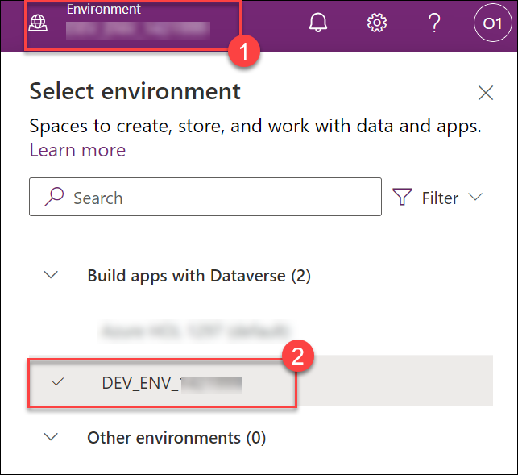

2. Now, click on **Solutions(1)** from the left hand side menu and click **Import Solution(2)**.

      

3.  Click **Browse**.
    
     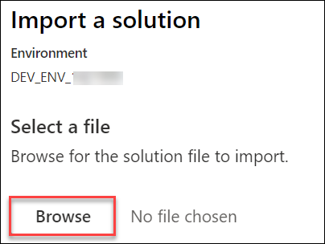
     
1. Navigate to this path `C:\LabFiles\Developer-in-a-day\Student\L01 - Getting started\Resources` in file explorer , select the **Prioritz_1_0_0_7.zip** file, and click **Open**.

1. Make sure the **Prioritz(1)** file is selected and Click **Next(2)**.
    
     
     
1. Click **Next** again on the import solution blade.

1. Under the **Connections** section, click on the ellipsis button **...(1)** next to **Microsoft Dataverse Priority**.

1. Ensure that  **odl_user(2)** you are using  is selected.

1. Click on **Import(3)**.

    
    
1. Wait until the solution import to complete.

     
     
1. You should now see the solution you imported in the list of solutions.

1. Open the **Prioritz** solution you imported.

4. Expand **Tables (1)** and select the **PrioritZ Topic (2)** table.
   
     

5. Select the **Columns** under Schema and review the columns of the **PrioritZ Topic** table.

   >**Info**: The standard columns are built-in, and all tables have them. The custom columns were created by the team for this application.
 
   

6. Select the **Relationships** tab from the Columns dropdown and review how this table is related to other tables.
 
    
 
    

1. Select **Cloud flow (1)** and open the **Import sample data – Topics (2)** flow.
 
    

9. Click on **Edit** button to review the flow.
  
    

10. Expand the **Parse JSON** step and review the data this flow will create.

    
    
    >>**Note**:If you're unable to expand the step, click on the ellipsis (...), then select Settings, and click Cancel.
    
12. Expand the **Apply to each topic** step.
    
    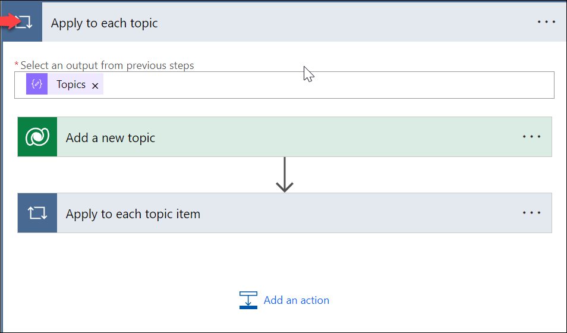

13. Expand the **Apply to each topic item** step.
   
     

14. The **Apply to each** step should look like the image below. This is the logic for the automation.
 
    

15. Click on the **<- back** button.
 
    

16. Click on the flow name to open the flow details screen.

     

17. Click on **Run** to run the flow.
   
     

18. Click the **Run flow** button on the Run flow blade.

     

     > **Note**: If you receive this error `Error from the token exchange: Permission denied due to missing connection` while running the flow, this is because the **Dataverse connection** is not being added correctly. Delete the imported solution and try to re-import the solution by performing the **Steps 6-14** of this task again, then try to trigger the flow again.

19. Click **Done** and wait for the flow run to complete.

     

20. The flow should run successfully. If you want, you can click on the run row and it will show you
    the details of what the flow did.
   
      

### Task 2: Test the apps

1. Navigate back to **PrioritZ** solution by clicking on **Cloud flows**. Alternatively, you can also open the **Power Apps** maker portal by using this URL `https://make.powerapps.com` if not already open. Make sure the development environment named **DEV_ENV_<inject key="Deployment ID" enableCopy="false" /> (2)** is selected.
       
   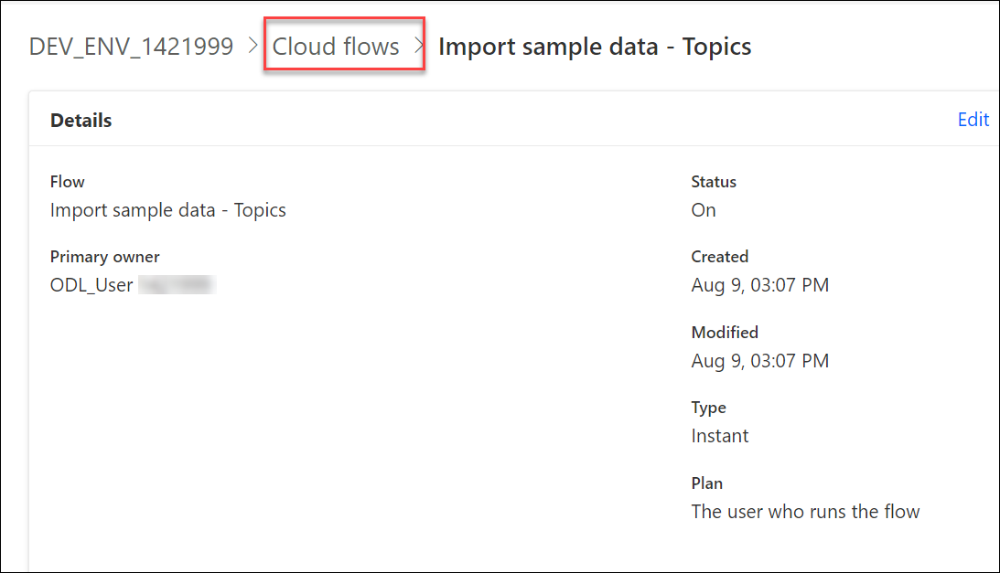

1. Navigate to **Solutions** blade by clicking on **Back to Solutions** **(<-)** button.

   
   
2. Select **Apps (1)** from the left-hand side menu of Power Apps,  you should see two applications named **PrioritZ Ask** and **PrioritZ Admin (2)**. 

     >**Info:** **PrioritZ Admin** app is used to manage topics being asked about and **PrioritZ Ask** app allows users to respond.

    

3. Launch the **PrioritZ Admin** application by clicking on **play** symbol.
    
    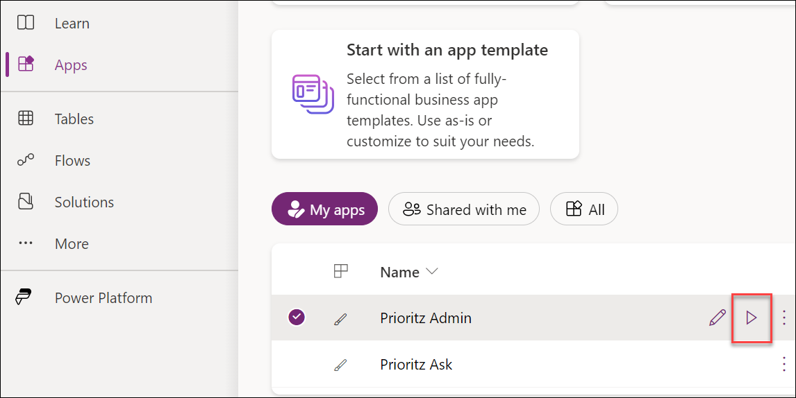

4. You should see the below four topics.

    

5. Click to open **Event banner** topic.

6. You should see the topic details with some topic items.

    

7. Click on the **<** back button.

    > **Note**: You should go back to the home screen.

9. Now, click on the **+** button to add a new topic.
    
    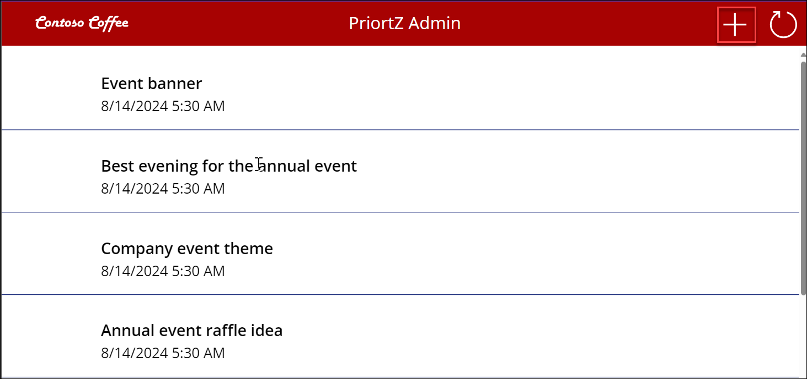

10. Provide the below information and click **add a picture** that is present below **Respond By** field.
     
     1. **Topic**: Enter `Change Taco Tuesday to some other food`
     
     1. **Details**: Enter `People are tired of tacos, what should we have instead of tacos?`
     
     1. **Respond By**: Select **today's date**.
     
     

11. Navigate to this path C:\LabFiles in file explorer, select **image.png** and click open.

12. Type **Tamale Tuesday** on the Choice field and click **add a picture** that is present below the Choice field.
     
      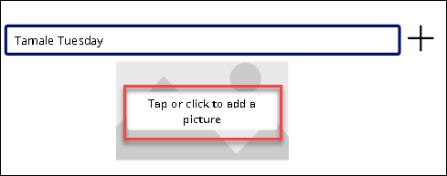

11. Navigate to this path `C:\LabFiles` in File Explorer, select **image.png** and click open.

13. Click **+** to add the choice.
     
      

14. Add a couple more choices by repeating **steps 12-14**.
       
       1. **Choice 1** : Enter `Steak Tuesday`
       
       2. **Choice 2**: Enter `Cheese and Wine Tuesday`

15. Click on **Save** button to save the topic.
    
    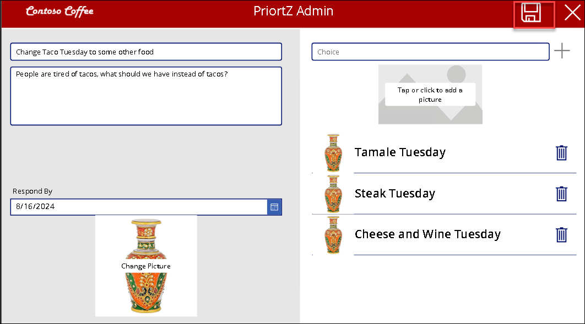

16. The new topic should be saved, and you should be navigated back to the main screen.

17. You should see the topic you added to the list of topics.

     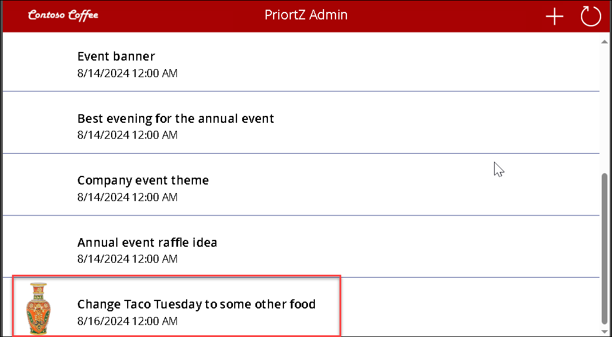

18. Close the PrioritZ Admin application by closing the browser tab in which the PrioritZ Admin application is open.

19. Select **Apps (1)** from the left-hand side menu of Power Apps and launch the **PrioritZ Ask (2)** application by clicking on play symbol.
     
     

20. You should see a list of topics. Open the **Change Taco Tuesday to some other food** topic that you created in the previous steps.

     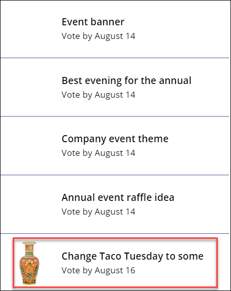

21. Click on the **up/down** icons order the items in the order you prefer them and click **Vote**.
     
      

22. You should be navigated back to the main screens, and you should see a notification message.   
      
    
23. Close the PrioritZ Ask app by closing the browser tab in which the PrioritZ Ask application is open.

## Exercise 2 – Add a column for My Notes

In this exercise, you will add a new column **My Notes** to the topic table and update the PriortZ Admin
application.

### Task 1: Add a new column

1. Navigate to the Power Apps maker portal by using the below URL if not already open. Make sure the development environment named **DEV_ENV_<inject key="Deployment ID" enableCopy="false" /> (2)** is selected.
    ```
    https://make.powerapps.com
   ```
2. Select **Solutions (1)** from the left-hand side menu of Power Apps and open the **PrioritZ (2)** solution.

   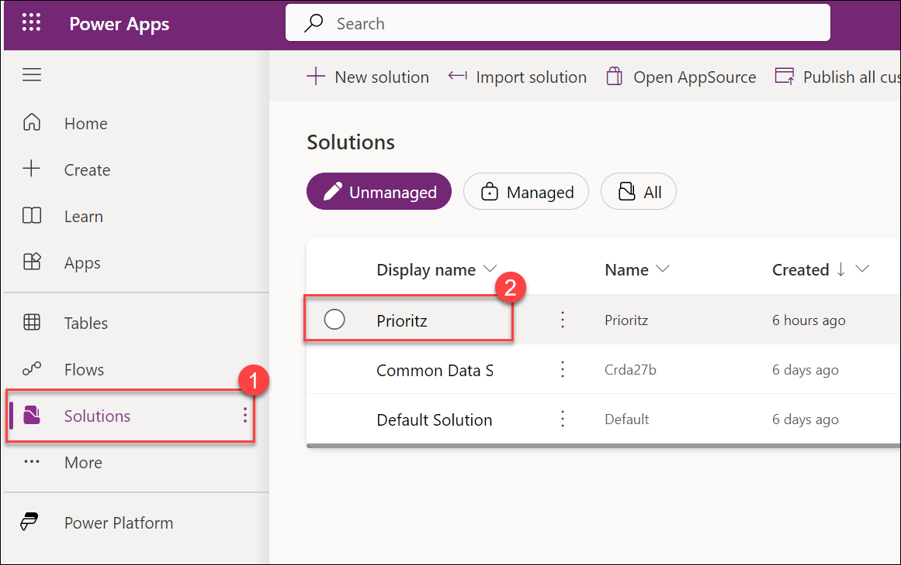

3. Expand **Tables(1)** and select the **PrioritZ Topic(2)** table.

4. Select the **Columns** tab that is present under **+ New(3)** and click **column(4)**.

    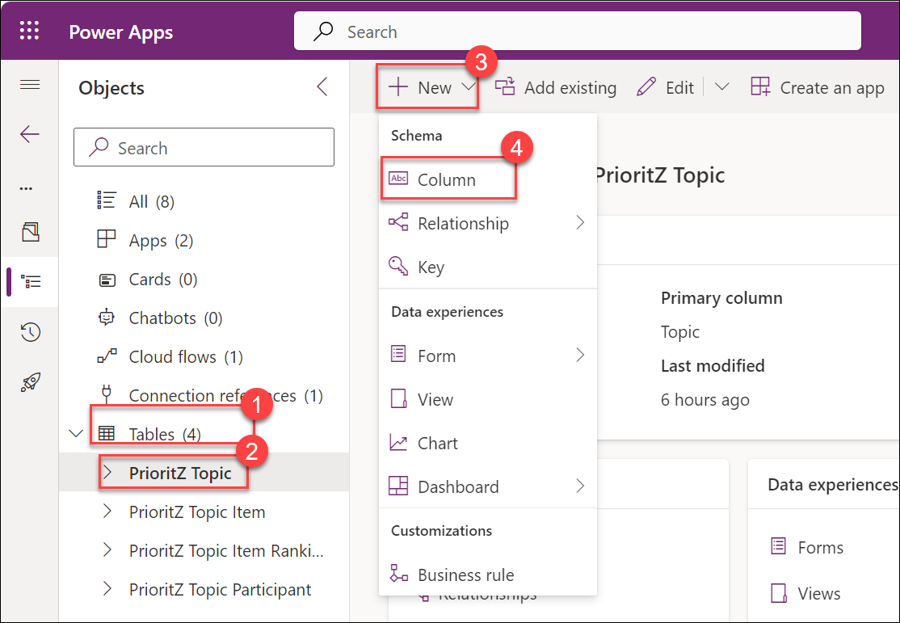

5. Enter the below value in the Display name field.

   ```
   My Notes
   ```
1. Now, search for **Plain text (1)** under Data type then select the one that comes under **Multiline Text (2)** , and click **Save (3)**.

    
   
   > **Note**: Do not navigate away from this page.

### Task 2: Update the admin app

1. Make sure you are still in the **PrioritZ** solution. Select **Apps (1)** under **Objects** and select the **PrioritZ Admin (2)** application and click on **Edit (3)**.
    
    

1. Select the **Add Topic Screen(1)**.

1. Click **+ Insert(2)** and select **Text input(3)**.
   
     

1. Double-click on the newly added **Text input** and enter the below value to rename the text input.

    ```
    Notes textbox
    ```
    
     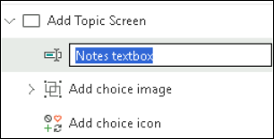

1. Make the add picture control smaller if needed, and move the **Respond By and label textbox** down and place the **Notes textbox** between the Details control and the Respond by label.
   
    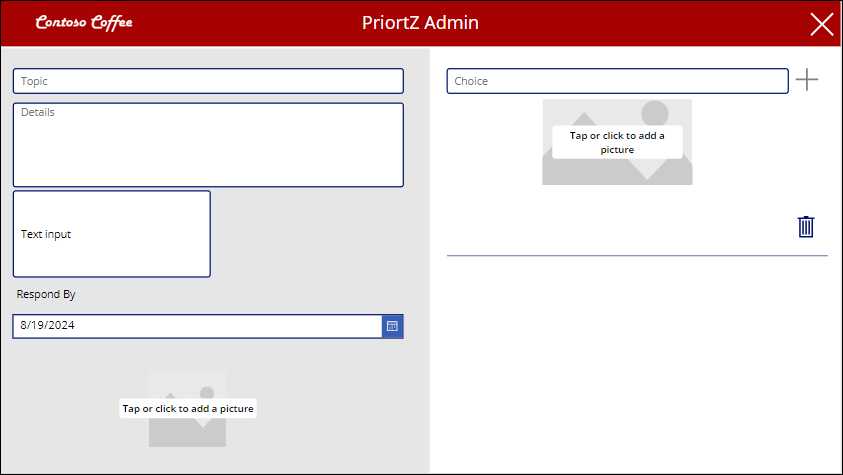

1. Select **Notes textbox** and then **HintText** from the properties dropdown.

    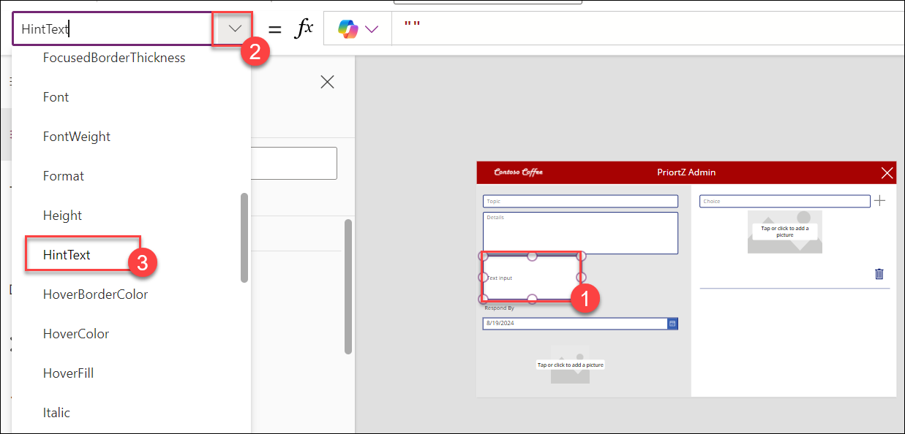

1. Change the **HintText** value of the Notes textbox to the below value. 

    ```
    My notes
    ```
   
    


1. Select the **Mode** from the properties dropdown and change its value by entering the below text.

    ```
    TextMode.MultiLine
    ```

    

1. Select **Save topic icon** under **Add Topics Screen** section.
     
     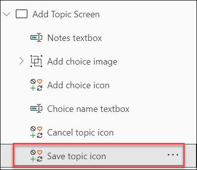

1. Replace the **OnSelect** formula of the **Save topic icon** with the formula below. The Patch creates
    a new row in the Dataverse table.
     
     

    ```
    Set(newTopic,Patch('Prioritz Topics',Defaults('Prioritz Topics'),{'My Notes': 'Notes textbox'.Text,Topic:'Topic name textbox'.Text,Details:'Topic details textbox'.Text,'Respond By':'respond by date picker'.SelectedDate,Photo:AddTopicImage.Image}));ForAll(colAddChoices,Patch('Prioritz Topic Items',Defaults('Prioritz Topic Items'),{Choice:ThisRecord.choice,'PrioritZ Topic':newTopic,Photo:ThisRecord.photo}));Back()
    ```
1. Select the **View Topic Screen (1)** from the **Screens** tab.

1. Click **+ Insert(2)** tab and select **Text label(3)**.

    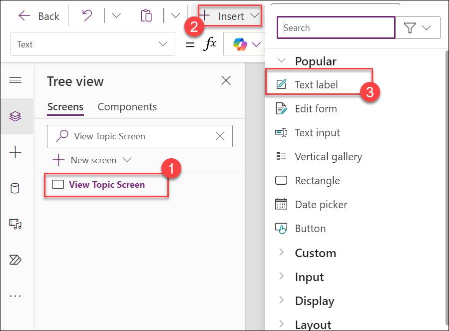

1. Double-click on the newly added label and enter the below value to rename the label you just added.

     ```
     Notes label
     ```
     
    

1. Change the **Text** value of the Notes label with the below text.

     ```
     'Topics gallery'.Selected.'My Notes'
     ```

1. Rearrange the controls and move the **Notes label** between the details label and the Topic items
    gallery.

1. Select the **Home Screen(1)** and click **Preview the app(2)**.
      
      

1. Click on the **+** button to add a new topic.

      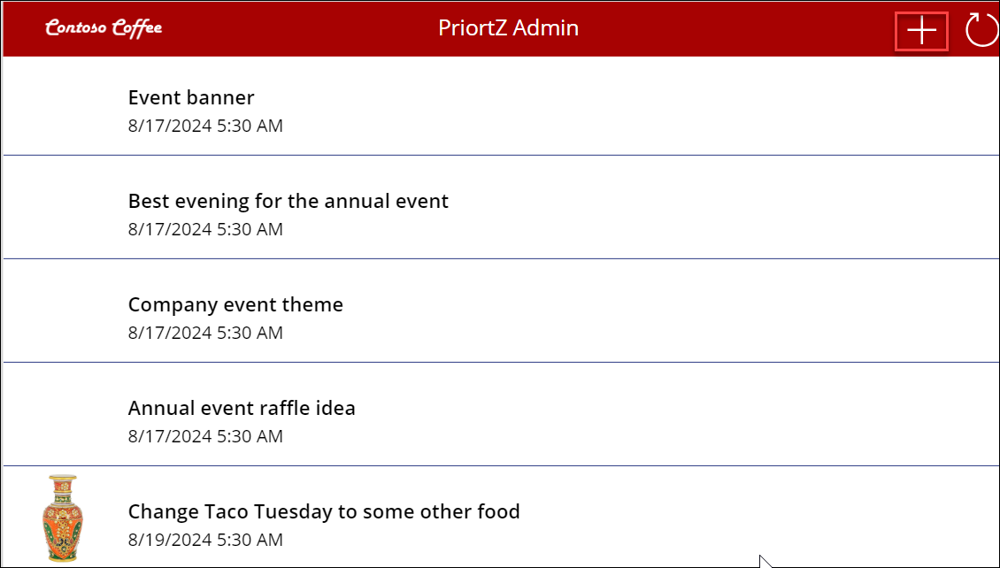

1. Fill out the form by providing the below information and click **add a picture** that is present below the **Respond By** field.

       1. Topic: `Test Notes` (1)
       
       2. Details: `Testing the notes` (2)
       
       3. Text input: `Prioritz Admin topic` (3)
       
       4. Respond By: **Today's date** (4)
      
      
1. Navigate to this path C:\LabFiles in file explorer, select **image.png** and click open.

1. Type **Test One** on the Choice field and click **add a picture** that is present below the Choice field.
     
      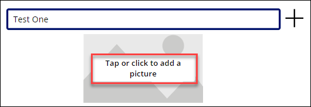

1. Navigate to this path `C:\LabFiles` in File Explorer, select **image.png** and click open.

1. Click **+** to add the choice.
     
      

1. Add one more choice by repeating **steps 20-22** of this task.
       
       1. **Choice 1** : Enter `Test Two`
1. After adding all the Choices and topic details, your screen should look like the below screenshot.

   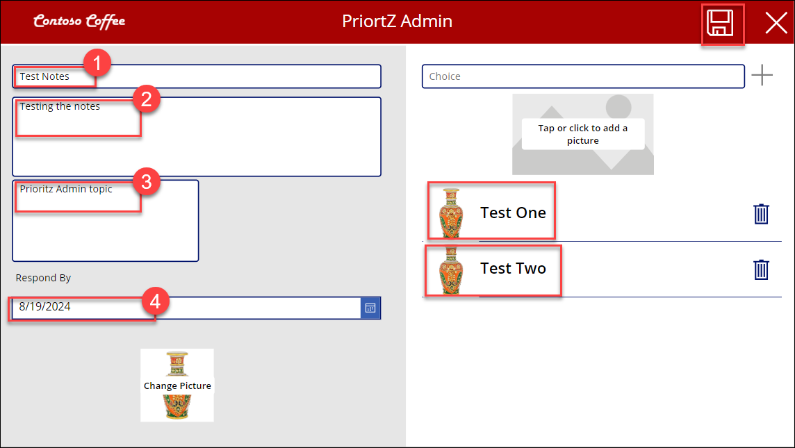
      
1. Now, click on the **Save** button. The new topic should be **saved**.
1. Click to open the **Test Notes** topic that you just created.
1. The notes **Prioritz Admin topic** that you added earlier should now be visible.
 
     

1. Close the app **preview**.
1. Click **Publish**.

    

1. Select Publish this version and wait for the publishing to complete.

     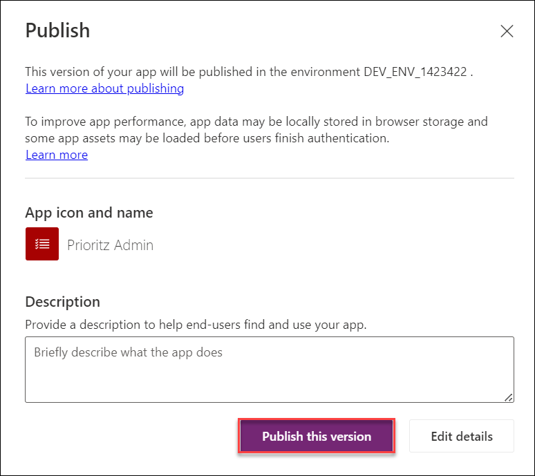

 1. You may close the **app designer**.

## Exercise 3 – Test the Power Platform CLI

In this exercise, you will review and test the Power Platform CLI extension in Visual Studio Code.

>**Note**: Visual studio code and Power platform CLI installation are already done as a part of the prerequisites.

1. Navigate to the Power Platform admin center by using the below URL and select **Environments**.
      ```
        https://admin.powerplatform.microsoft.com/environments
      ```

1. If you see the pop-up **Stay Signed in?**, click **No**.

2. Click to open your dev environment named **DEV_ENV_<inject key="Deployment ID" enableCopy="false" />**.

3. Right-click on the **Environment URL** value and paste the value in Notepad.
 
    >**Note**: Make sure the Environment URL value is copied along with the **https**. Your copied value should look like this `https://orgxxxxxx.crm.dynamics.com/`

    

4. In the JumpVM, start **Visual Studio Code** using the shortcut available on the desktop.

   
   
6. Click **Terminal** and select **New Terminal**.

    

7. Run the below command in the terminal.
   ```
   pac
   ```
   
   > **Info:** If you encounter an error after using the **pac** command, download the Power Platform CLI from the **https://aka.ms/PowerAppsCLI** link, 
     open   the installer, and complete the installation. Then, try the step again.

8. Replace `<your environment URL>` in the below command with the value of the environment URL that you copied earlier then run the command. 
   ```
   pac auth create --name DevAuth --url <your environment URL>
   ```

   > **Info:** After adding the environment URL, the command will look like this: `pac auth create --name DevAuth--url https://org32172839283.crm.dynamics.com/`
  
    

1.  Complete the **Sign in** process, using the below credentials.

      * Email/Username: <inject key="AzureAdUserEmail"></inject>
      * Password: <inject key="AzureAdUserPassword"></inject>

9. Select **Power Platform (1)** tool, you should now have at least one **auth profile (2)**. If you have more than one profile, make sure the profile you created is selected
   
    

    > **Note** : If you are able to see the **Universal Profile** instead of **DeVAuth** profile, it is because of adding the incorrect **Environment URL** value in the **pac auth create** command in Step 9. To fix this issue, follow the below steps:

      1. Delete the **Universal Profile** from Visual Studio Code by clicking on the delete button.
      2. Copy the correct **Environment URL** value by following **Step 5** of this task. 
      3. Perform the **Step 9** of this task again to create the auth profile.

10. Click **Terminal** and select **New Terminal** if not already open.

     

11. Run the command below to see a list of solutions.

      ```
      pac solution list
      ```
12. You should see a list of solutions installed on your environment.
    
    

## Summary

In this lab , you learned to import and execute a starting solution, customize it by adding a new column and updating the admin app, and verify functionality using the Power Platform CLI.

## You have successfully completed the lab
