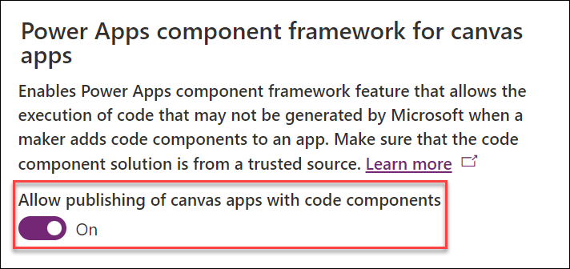
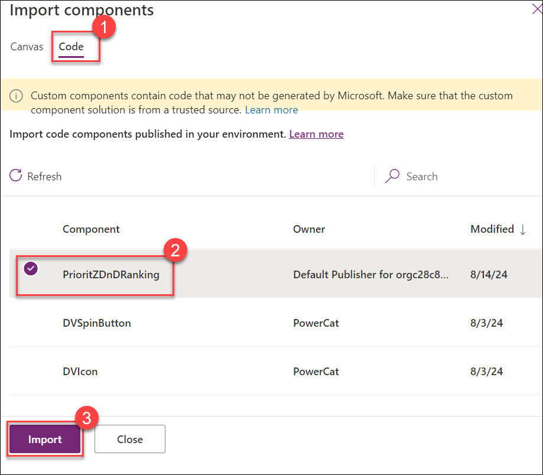
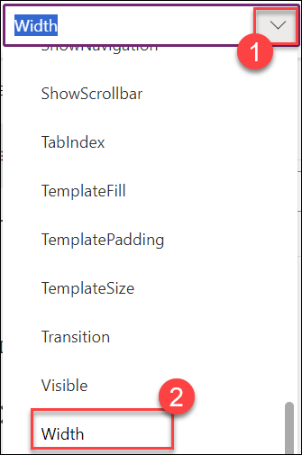
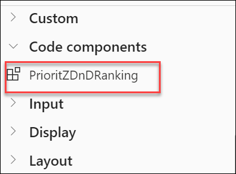
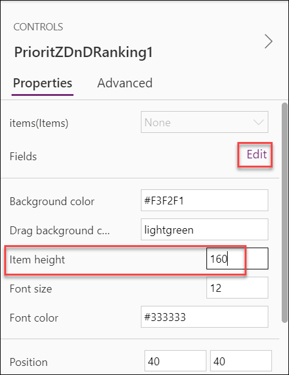
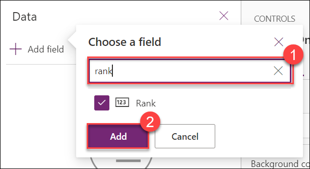

# Laboratório 02 - Construir um componente de código

## Duração estimada: 90 minutos

Trabalhando como parte da equipe de fusão do PrioritZ, você foi solicitado a criar um componente de código do Power Apps para permitir a classificação de prioridade de arrastar e soltar itens no PrioritZ Ask Power App. Você criará
um componente de código usando a estrutura React JavaScript. Uma abordagem de componente de código é usada para
para atender ao requisito porque não existe um controlo semelhante já incorporado.

Você colaborou com os criadores de aplicativos para identificar as seguintes propriedades para permitir que eles
configurar o componente de código na aplicação:

- BackgroundColor
- DragBackgroundColor
- ItemHeight
- FontSize
- FontColor

O aplicativo PrioritZ Ask preparará uma coleção dos itens a serem classificados que serão vinculados como o conjunto de dados para o
o componente de código. Quando um item é arrastado e largado, o componente de código gera um evento OnSelect
que será tratado pela aplicação de alojamento. A aplicação de alojamento actualizará os itens da coleção com
a sua nova classificação. O componente de código será stateless.

## Objectivos do laboratório

- Exercício 1: Construir o componente de código 
- Exercício 2: Usar o componente de código 
- Exercício 3: Adicionar o componente de código à solução 

## Exercício 1 - Construir o componente de código

Neste exercício, você irá construir o componente de código.

### Tarefa 1: Criar o componente de código

1. Inicie o **Visual Studio Code** se ainda não estiver aberto usando o atalho disponível na área de trabalho.

   
   
2. Selecione o separador **Power Platform (1)** e certifique-se de que o seu perfil **Dev Auth (2)** está selecionado. 
    
   >**Nota**: O separador Power Platform já está instalado.
    
    

3. Clique em **Terminal (1)** e selecione **New Terminal (2)**.
     
     

4. Na janela Terminal, crie um novo diretório executando o comando abaixo.

    ```
    md PrioritZDnDRanking
    ```
5. Execute o comando abaixo para mudar para o diretório PrioritZDnRanking que você criou.

    ```
    cd PrioritZDnDRanking
    ```
6. Agora você deve estar no diretório que criou. Crie um novo projeto de componente e instale as dependências executando o comando abaixo.
    
     ```
     pac pcf init -ns ContosoCoffee --name PrioritZDnDRanking --template dataset --framework react --run-npm-install
     ```
     
     

7. O projeto do componente framework deve ser criado com sucesso.

    

8. Execute o comando abaixo para abrir o projeto.
    ```
    code -a.
    ```

1. Se lhe for apresentado o pop-up abaixo, clique em **Sim** para confiar nos autores dos ficheiros.

    

9. Reveja os ficheiros de componentes de código criados selecionando o separador **Explorer**.
    
     

10. Expanda a pasta **PrioritZDnDRanking** e, em seguida, expanda a subpasta **generated**.

11. Abra o ficheiro **ControlManifest.Input.xml**. O manifesto é o ficheiro de metadados que define um
 componente, incluindo as propriedades expostas à aplicação de alojamento.

    

12. Localize **data-set** elemento XML no **linha número 21** no ficheiro **ControlManifest.Input.xml**.

    

13. Altere o **name** para **items** e o **display-name-key** para **items**. Isto define a propriedade que a aplicação se liga a uma coleção de itens.

    

14. Adicione as seguintes propriedades entre a etiqueta de fecho do elemento de conjunto de dados `/data-set>` e a etiqueta de abertura do elemento `<resources>`.

    > Adicione as seguintes propriedades após **linha número 26** no ficheiro **ControlManifest.Input.xml**.

    ```
    <property name="BackgroundColor" display-name-key="Background cor" usage="input" of type="SingleLine.Text" default-value="#F3F2F1"/>
    <property name="DragBackgroundColor" display-name-key="Drag background colo" usage="input" of type="SingleLine.Text" value="lightgreen"/>
    <property name="ItemHeight" display-name-key="Item altura" usege="input" of type="Whole.None" default-value="32"/>
    <property name="FontSize" display-name-key="Font size" usage="input" of type="Whole.None" default-value="12"/>
    <property name="FontColor" display-name-key="Font cor" usage="input" of-type="SingleLine.Text" default-value="#333333"/>
    ```

    

15. Localize a secção `<recursos>` e adicione o código abaixo após o **code path** para adicionar o recurso **css**. Isto garantirá que os nossos estilos serão agrupados com o componente de código quando este for implementado.

    ```
    <css path="css/PrioritZDnDnanking.css" order="1" />
    ```

    

    >**Nota**: Certifique-se de que não descolhe o caminho **resx**, pois estará a enfrentar um problema na próxima tarefa ao construir o componente de código se este não for comentado.

 16. Observe os dois recursos seguintes. Isto declara a dependência do componente destes dois
 bibliotecas. Isto é o resultado da especificação – framework React na inicialização.
        
     ```
     <plataform-library name="React" version="16.8.6" />
     <plataform-library name="Fluent" versão="8.29.0" />
     ```
     
     

17. Clique em **Ficheiro** e seleccione **Guardar tudo** para guardar as suas alterações.
18. Certifique-se de que ainda tem o ficheiro **ControlManifest.Input.xml** selecionado e clique em **Nova pasta**.

    

19. Refira o novo bunda da pasta **css**.
20. Selecione a nova pasta **css** que criou e clique em **Novo ficheiro**

    

 21. Refira o novo ficheiro **PrioritZDnDranking.css**
 22. Cole o seguinte CSS no ficheiro **PrioritZDnDRAnking.css**.

        ```
        .prioritydnd-scroll-contentor {
        tamanho de caixa: caixa de fronteira;
        preenchimento: 2px;
        overflow-y: auto;
        overflow-x: oculto;
        posição: relativo;
        }
        .prioritydnd-item-contentor {
        selecionar o utilizador: nenhum;
        exibição: flex;
        items de alinhamento: centro;
        }
        .prioritydnd-item-coluna {
        margem: 8px;
        }
        ```
23. O ficheiro deve agora parecer-se com o seguinte.

    

24. Clique em **Ficheiro** e seleccione **Guardar tudo** para guardar as suas alterações.

### Tarefa 2: Implementar a lógica do componente

1. Selecione o ficheiro do componente **HelloWorld.tsx**, clique com o botão direito do rato no mesmo e selecione **Apagar** para remover o ficheiro de componentes à medida que este é criado automaticamente e não o iremos utilizar.

    

2. Navegue para este caminho `C:\LabFiles\Developer-in-ay\Student\L02 - Build a um code componente\Resources` no ficheiro explorador.

3. Arraste o ficheiro **PriorityComponent.tsx** e deixe-o largar na pasta **PrioriZDnDranking**.

4. O ficheiro **PriorityComponent.tsx** deve agora estar na pasta **PrioriZDnDranking**.

    

5. Clique em **Ficheiro** e guarde as suas alterações.

6. Abra o **PriorityComponent.tsx** e reveja o conteúdo. Isto implementa o React
 componente que será renderizado para representar os nossos itens dragáveis.

7. A linha de notificação 9 `de react-beautiful-dnd` tem uma sublinhado vermelho. Este é um pacote npm o
 componentes utilizamos que não fazemos referenciados.

    

 8. Execute o seguinte comando numa janela de terminal para adicionar uma referência a react-beautiful-dnd.

    ```
    npm instalar reage-beautiful-dnd
    ```
    >**Nota**: Se receber este erro **npm não for reconhecido**, execute os passos abaixo:

    1. Abra o PowerShell e execute este comando `choco install -y --force nodejs`.
    
    2. Assim que a execução do comando estiver concluída, feche o Código do Estúdio do Visual e abra-o novamente.
    
    3. Execute **Passo 8** desta tarefa novamente para instalar o pacote **react-beautiful-dnd**.

9. Execute o seguinte comando para as definições de tipo.

    ```
    npm i --save-dev @types/react-beautiful-dnd
    ```

10. Observe o u vermelhonderline na linha 9 foi resolvido.

11. Abra o ficheiro **index.ts**.

12. Remova a seguinte linha (linha número 2 no ficheiro Index.ts), pois já não estamos a utilizar o HelloWorld

    ```
    import {HelloWorld, IHelloWorldProps } from "./HelloWorld";
    ```

    

 13. Adicione o código abaixo ao ficheiro **index.ts** após **linha número 1**. Isto fará referência ao PriorityComponent.

     ```
     import { PriorityComponent, PriorityComponentProps } from './PriorityComponent';
     ```
    
     


 15. Localize a classe **Export** na **linha número 7**.

     

 16. Adicione o seguinte código abaixo dentro da classe **export**. Isto define algumas variáveis ​​de trabalho que
 estará a utilizar na lógica da classe.

     ```
     contexto privado: ComponentFramework.Context<IInputs>;
     artigos privados: ComponentFramework.PropertyTypes.DataSet;
     estado privado: ComponentFramework.Dictionary;
     ```
            
     


 17. Localize a função **init**.

     

 18. Cole o código abaixo dentro da função **init**. Esta lógica inicializa as nossas variáveis ​​de classe do
 valores de tempo de execução e permite a notificação de redimensionamento.

     

     ```
     this.context = contexto;
     context.mode.trackContainerResize(true);
     ```

19. Localize a função **updateView**.

    

20. Substitua a função **updateView** pela função abaixo. Esta lógica cria o Elemento React
 do PriorityComponent e adiciona-o ao DOM virtual.

    ```
    public updateView(context: ComponentFramework.Context<IInputs>): React.ReactElement {
    const dataset = context.parameters.items;
    return React.createElement(PriorityComponent, {
    largura: context.mode.allocatedWidth,
    altura: context.mode.allotedHeight,
    itemHeight: context.parameters.ItemHeight.raw,
    fontSize: context.parameters.FontSize.raw,
    fontColor: context.parameters.FontColor.raw,
    conjunto de dados: conjunto de dados,
    onReorder: this.onReorder,
    backgroundColor: this.context.parameters.BackgroundColor.raw,
    dragBackgroundColor:
    this.context.parameters.DragBackgroundColor.raw,
    } como PriorityComponentProps);
    }
    ```

    

21. Adicione o código abaixo após a função **destroy**. Esta lógica trata do evento onReorder de o PriorityComponent e identifica os itens envolvidos na aplicação de alojamento como itens selecionados.

    ```
    onReorder = (sourceIndex: número, destinoIndex: número): void => {
    conjunto de dados const = this.context.parameters.items;
    const sourceId = dataset.sortedRecordIds[sourceIndex];
    const de destinoId = dataset.sortedRecordIds[destinationIndex];
    // levanta o evento OnSelect
    this.context.parameters.items.openDatasetItem(dataset.records[sourceId].getNamedReference());
    // define a propriedade SelectedItems
    this.context.parameters.items.setSelectedRecordIds([sourceId, destinoId]);
    };
    ```

    

    > **Nota** : **Destruição** função estará presente no final da classe **PrioritZDnDranking**.

22. Após concluir todos os passos, o seu ficheiro `index.ts` deverá conter o seguinte código.

    ```
    import { IInputs, IOutputs } from "./gerated/ManifestTypes";
    import { PriorityComponent, PriorityComponentProps } from './PriorityComponent';
    import * como React from "react";


    export class PrioritZDnDRAnking implementa ComponentFramework.ReactControl<IInputs, IOutputs> {
    contexto privado: ComponentFramework.Context<IInputs>;
    artigos privados: ComponentFramework.PropertyTypes.DataSet;
    estado privado: ComponentFramework.Dictionary;
    private theComponent: ComponentFramework.ReactControl<IInputs, IOutputs>;
    private notifyOutputChanged: () => void;

    /**
    * Construtor vazio.
    */
    construtor() { }

    /**
    * Utilizado para inicializar a instância de controlo. Os controlos podem iniciar chamadas de servidor remoto e outras ações de inicialização aqui.
    * Os valores do conjunto de dados não são inicializados aqui, utilize updateView.
    * @param context Todo o saco de propriedade disponível para controlar via Context Object; Contém valores conforme configurado pelo
    personalizador mapeado para nomes de propriedades definidos no manifesto, bem como nas funções de utilidade.
    * @param notifyOutputChanged Um método de callback para alertar a framework que o controlo tem novas saídas prontas a ser recuperadas
    assíncrona.
    * @param State Um pedaço de dados que persiste numa sessão para um único utilizador. Pode ser definido em qualquer ponto de uma vida de controlo
    ciclo chamando 'setControlState' na interface Modo.
    */
    public init(contexto: ComponentFramework.Context<IInputs>,
    notifyOutputChanged: () => void,
    estado: ComponentFramework.Dictionary
    ): vazio {
    this.context = contexto;
    context.mode.trackContainerResize(true);
    this.notifyOutputChanged = notifyOutputChanged;
    }

    /**
    * Chamado quando qualquer valor no saco da propriedade foi alterado. Isto inclui valores de campo, conjuntos de dados, valores globais, como o contentor
    altura e largura, estado offline, valores de metadados de controlo, como o rótulo, o visível, etc.
    * @param context Todo o saco de propriedade disponível para controlar via Context Object; Contém valores conforme configurado pelo personalizador
    mapeados para nomes definidos no manifesto, bem como funções de utilidade
    * @returns ReactElement raiz react element para o controlo
    */
    public updateView(context: ComponentFramework.Context<IInputs>): React.ReactElement {
    const dataset = context.parameters.items;
    return React.createElement(PriorityComponent, {
    largura: context.mode.allocatedWidth,
    altura: context.mode.allotedHeight,
    itemHeight: context.parameters.ItemHeight.raw,
    fontSize: context.parameters.FontSize.raw,
    fontColor: context.parameters.FontColor.raw,
    conjunto de dados: conjunto de dados,
    onReorder: this.onReorder,
    backgroundColor: this.context.parameters.BackgroundColor.raw,
    dragBackgroundColor:
    this.context.parameters.DragBackgroundColor.raw,
    } como PriorityComponentProps);
    }

    /**
    * É chamado pela estrutura antes do controlo que recebe novos dados.
    * @returns um objeto baseado na nomenclatura definida em manifesto, esperando objectos para propriedades marcadas como "ligado" ou "saída"
    */
    public getOutputs(): IOutputs {
    devolver { };
    }

    /**
    * Chamado quando o controlo será removido da árvore DOM. Os controlos devem utilizar esta chamada para limpeza.
    * ou seja, cancelar quaisquer chamadas remotas pendentes, remoção de ouvintes, etc.
    */
    public destruição(): void {
    // Adicione o código ao controlo de limpeza, se necessário
    }
    onReorder = (sourceIndex: número, destinoIndex: número): void => {
    conjunto de dados const = this.context.parameters.items;
    const sourceId = dataset.sortedRecordIds[sourceIndex];
    const de destinoId = dataset.sortedRecordIds[destinationIndex];
    // levanta o evento OnSelect
    this.context.parameters.items.openDatasetItem(dataset.records[sourceId].getNamedReference());
    // define a propriedade SelectedItems
    this.context.parameters.items.setSelectedRecordIds([sourceId, destinoId]);
    };
    }
    ```
 
23. Abra o ficheiro **package. json**.

24. Localize o objeto **dependências** JSON.

    

25. Substitua **dependências** pelo JSON abaixo.

    ```
    "dependências": {
    "@fluentui/react": "8.29.0",
    "eslint-config-prettier": "^8.5.0",
    "eslint-plugin-prettier": "^4.0.0",
    "eslint-plugin-reage": "^7.29.4",
    "eslint-plugin-reage-gans": "^4.4.0",
    "eslint-plugin-sonarjs": "^0.13.0",
    "preto": "^2.6.1",
    "reagir": "16.8.6",
    "react-beautiful-dnd": "^13.1.0",
    "react-dom": "16.8.6"
    },
    ```

25. Navegue até ao ficheiro **.eslintric. json(1)** da navegação esquerda para adicionar a nova regra de flexição. Localize **rules(2)** na **linha número 21** e cole as regras abaixo.

    ```
    "não-inutilizado-vars": ["off"],
    "no-def": ["off"]
    ```

    


26. Clique em **Ficheiro** e guarde todas as suas alterações.

27. Clique em **Terminal** e seleccione **Novo Terminal**.

    

28. Execute o comando abaixo. Isto irá construir o seu componente e identificar quaisquer problemas.

    ```
    npm run-script build
    ```

    > **Nota**: Se a operação de compilação falhar com este erro **`Root element está em falta`**, certifique-se de que o **resx path** é comentado no ficheiro Manifest.Xml e tente construir o componente novamente.

 29. A construção deve ter sucesso. Se algum erro, resolva-os antes de prosseguir.

     

 30. Execute o comando abaixo para iniciar o chicote de teste.

        ```
        npm arranque
        ```

31. O chicote de teste deve iniciar, se não, copiar o endereço e colar-o numa nova janela do browser. Experimente arrastar os itens e ver se o comportamento funciona como esperado.

    

    > **Nota**: Se o chicote de teste não começar como esperado, não poderá ver a saída esperada como mencionado. Verifique se seguiu as instruções anteriores e adicionou o código corretamente nos ficheiros **Manifest e Index**.

32. Feche o chicote de teste fechando a aba do navegador.

33. Pare a corrida segurando a tecla **[CONTROL]** + **C**.

34. Tipo **Y** e [ENTER].

    

35. Execute o comando abaixo para empurrar a compidentificador para o seu ambiente.
    
    ```
    pac pcf push --publisher-prefix contose
    ```

    > **Nota**:

    1. Se a operação de push falhar com o erro **Desculpe, a aplicação encontrou um erro não recuperável e precisará de terminar**, certifique-se de que seguiu as instruções anteriores e adicionou o código corretamente em **Ficheiros de manifesto e índice**.

       Além disso, pode encontrar os ficheiros **Manifest e Index** na localização `C:\LabFiles`, pode comparar o seu código com estes ficheiros e corrigir os problemas se houver alguma tentativa de empurrar o componente executando o * *pac push comando** novamente.

    2. Se a execução falhar com um erro de pacote Nuget, execute o comando abaixo no PowerShell e tente executar novamente o comando acima.

        ```
        dotnet nuget adicionar fonte https://api.nuget.org/v3/index.json -n nuget.org --configfile $env:APPDATA\NuGet\NuGet.Config
        ```

36. Aguarde que a solução seja importada e publicada no seu ambiente.

    

### Tarefa 3: Confirme que o controlo foi adicionado ao ambiente

1. Navegue até ao portal do fabricante de aplicações Power, utilizando o URL abaixo, se ainda não estiver aberto. Certifique-se de que o ambiente de desenvolvimento denominado **DEV_ENV_<inject key="Deployment ID" enableCopy="false" /> (2)** é selecionado.

    ```
    https://make.powerapps.com/
    ```

2. Selecione **Soluções** e abra a solução **PowerAppsTools**.

    

 3. Confirme que o controlo personalizado está nesta solução.

    

## Exercício 2 – Use Componente de Código

Neste exercício, irá utilizar o componente de código que criou na aplicação de tela PrioritZ Ask.

### Tarefa 1: Permitir a estrutura do componente Apps Power

Nesta tarefa, permitirá a publicação de aplicações em tela com componentes de código para o seu ambiente.

1. Navegue até ao centro de administração da Power Platform utilizando o URL abaixo e selecione ambientes.

    ```
    https://admin.powerplatform.microsoft.com/environments
    ```

2. Abra o ambiente de desenvolvimento denominado **DEV_ENV_<inject key="Deployment ID" enableCopy="false" />** que está a utilizar para este laboratório.

3. Clique em **Definições** no menu superior.

    

4. Expandir **Produtos (1)** e seleccione **Castas (2)**.

    

 5. Adicione **Permitir publicação de aplicações de tela com componentes de código** e deslize para baixo clique **Guardar**.

    

    

 ### Tarefa 2: Editar aplicação em tela

Nesta tarefa, irá editar a aplicação PrioritZ Ask em tela para utilizar o componente de código que criou.

1. Navegue até ao portal do fabricante de aplicações Power, utilizando o URL abaixo, se ainda não estiver aberto. Certifique-se de que o ambiente de desenvolvimento denominado **DEV_ENV_<inject key="Deployment ID" enableCopy="false" />** é selecionado.

    ```
    https://make.powerapps.com/
    ```

2. Selecione **Soluções** e abra a solução **PrioritZ**.

3. Selecione **Apps (1)** , selecione a aplicação **PrioritZ Ask (2)** e clique em **Editar (3)**.

    

4. Selecione o separador **Componentes**, clique na seta para trás para **Importar**
 **componentes**.

    

1. Selecione o **separador Código (1)**, selecione o componente de código **(2)** que criou e clique em **Importar (3)**.

    

7. Selecione o separador **Screen**.

8. Expandir **votescreen (1)** e Selecione a galeria **Votes (2)**.

    

1. Selecione a **Diração** do menu suspenso das propriedades.

    

9. Defina o valor de **Da largura** da galeria Votes para **570**.

    

10. O ecrã deve agora parecer a image abaixo.

    

11. Selecione o **Votes Screen** e clique em **+ Inserir**.

    

12. Selecione o componente **PrioritZDnDranking** em **Componentes do código**.

    

13. Aceda ao separador visualização da Árvore e seleccione o **PrioritZDnDRAnking** que acabou de adicionar.

14. Defina o valor **Items** do componente **PrioritZDnDRAnking** para a fórmula abaixo.

    ```
    'Galeria de votos'. Todos os Items
    ```

    

15. Selecione o **PrioritZDnDRAnking**, aceda ao painel **Propriedades** que está presente no lado direito do ecrã, defina **Item Altura** 160 e clique em **Editar campos**.

    

16. Clique em **+ Adicionar campo** para adicionar um novo campo.

17. Selecione **Classificação (1)** e clique em **Adicionar (2)**.

    

18. A classificação deve agora mostrar-se no controlo, mas está resolvido descendente.

19. Selecione a galeria **Votes**, selecione a propriedade **Items** do menu suspenso da propriedade e altere a ordem de classificação para **Ascending**.

    

 20. A classificação deve agora classificar ascendente.

21. Selecione o **Pcomponente rioritZDnDRAnking** e depois **X** propriedade do menu suspenso da propriedade.

    

22. Defina o valor **X** do componente **PrioritZDnDRAnking** na fórmula abaixo.

    ```
    'Galeria de votos'. Largura
    ```

23. Selecione a propriedade **Da largura** do componente **PrioritZDnDRAnking** do menu suspenso da propriedade e defina o seu valor para **60**.

24. Selecione a propriedade **Height** do componente **PrioritZDnDRAnking** do menu suspenso da propriedade e defina o seu valor com a fórmula abaixo.

    ```
    'Galeria de votos'. Altura
    ```

25. Selecione a propriedade **ItemHeight** do componente **PrioritZDnDRAnking** do suspensão da propriedade e defina o seu valor com a fórmula abaixo

    ```
    'Galeria de votos'.TemplateHeight
    ```

26. Selecione a propriedade **BackgroundColor** do componente **PrioritZDnDRAnking** do menu suspenso da propriedade e defina o seu valor para **"LightBlue"**

27. Selecione a propriedade **DragBackgroundColor** do componente **PrioritZDnDranking** do menu suspenso da propriedade e defina o seu valor para **"#A70202"**

28. Selecione a propriedade **Y** do componente **PrioritZDnDRAnking** do suspensão da propriedade e defina o seu valor com a fórmula abaixo.

    ```
    'Galeria de votos'.Y
    ```

29. Selecione a propriedade **OnSelect** do componente **PrioritZDnDRAnking** do suspensão da propriedade e defina o seu valor com a fórmula abaixo.

    ```
    Com(
    {
    fonteRank: Primeiro(Self. SelectedItems). Classificação,
    destino Rank: Last(Self. SelectedItems). Classificação
    },
    Se(
    fonteRank < destino Rank,
    // Movendo-se para cima
    AtualizaçãoIf(
    colVotes,
    Classificação >= fonte Rank && Classificação <= de destino Classificação,
    {
    Classificação: If(
    Classificação <> fonte Rank,
    Classificação - 1,
    destino Rank
    )
    }
    );
    );
    Se(
    fonteRank > destino Rank,
    // Desci
    AtualizaçãoIf(
    colVotes,
    Classificação >= destino Rank && Classificação <= fonte Rank,
    {
    Classificação: If(
    Classificação <> fonte Rank,
    Classificação + 1,
    destino Rank
    )
    }
    );
    );

    );
    ```

30. Selecione o **Ecrã de casa** e clique em **Play**.

31. Selecione um dos **temas**.

32. Pode visualizar como está no ecrã de um telefone utilizando o emulador.

    

33. Arraste um dos itens do tópico e deixe-o ativá-lo num local diferente.

    

34. O arrastar/desembarque deve funcionar como esperado.
35. Feche a antevisão.
1. Clique em **Publique**.

    

38. Selecione **Publique esta versão** e aguarde que a publicação seja concluída.
39. Pode **fechar** o estúdio de aplicações em tela.

## Exercício 3 – Adicionar Componente de Código à Solução

Neste exercício, irá adicionar o componente de código que criou à solução PrioritZ.

### Tarefa 1: Adicione o componente à solução

1. Navegue até ao portal do fabricante de aplicações Power, utilizando o URL abaixo, se ainda não estiver aberto. Certifique-se de que o ambiente de desenvolvimento denominado **DEV_ENV_<inject key="Deployment ID" enableCopy="false" /> (2)** é selecionado.

    ```
    https://make.powerapps.com/
    ```

2. Selecione **Soluções** e abra a solução **PrioritZ**.
3. Clique em **Adicionar existente** e seleccione **Mais | Developer | Controlo personalizado**.

    

 4. Selecione **contoso_ContosoCoffee.PrioritZDnDranking (1)** e clique em **Adicionar (2)**.

    

 5. Clique em **Publique todas as personalizações** e aguarde que a publicação seja concluída.

    

## Resumo

Neste laboratório, aprendeu a criar um componente de código, a implementar a sua lógica, a integrá-lo numa aplicação de lona e a adicioná-la a uma solução dentro da Power Platform.

## Concluiu o laboratório com sucesso
