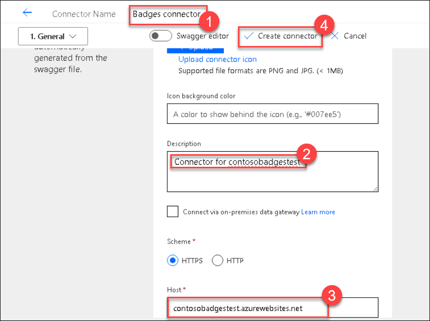
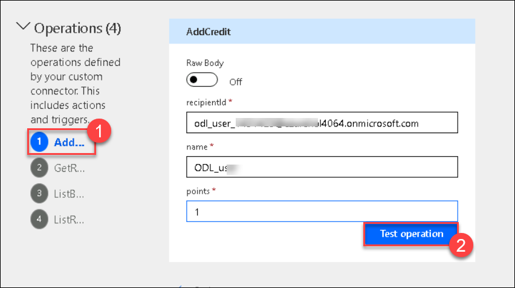
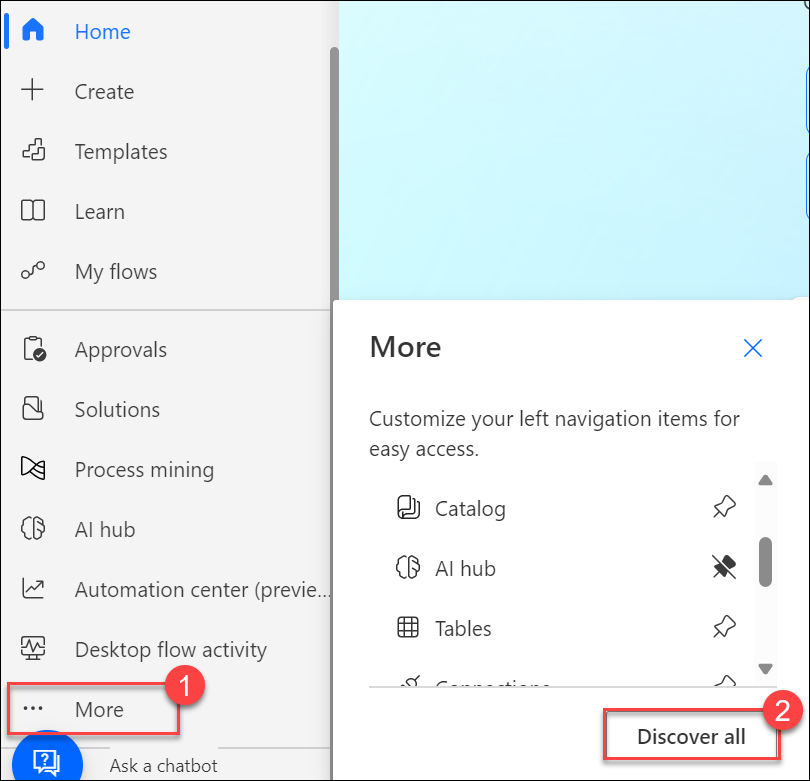
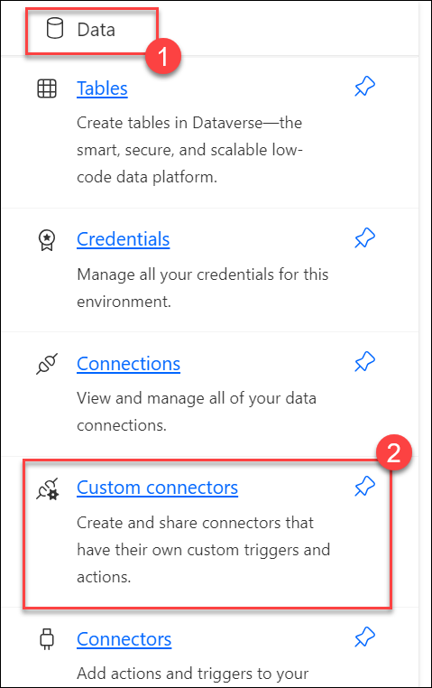

# Laboratório 03 - Conector personalizado para a API existente

## Duração estimada: 130 minutos

Trabalhando como parte da equipa de PrioritZ fusion, estará a configurar um conector personalizado para uma API existente. A equipa gostaria de adicionar um crachá à aplicação PrioritZ para dar crédito aos utilizadores quando estes concluíram a classificação de um item. A equipa identificou uma API existente, mas não tem um Power Platform Conector.

## Objectivos de laboratório

- Exercício 1: Criar base de dados no ambiente padrão
- Exercício 2: Criar uma Solução
- Exercício 3: Crie um conector personalizado
- Exercício 4: Adicionar código personalizado
- Exercício 5: Testar o Conector Personalizado
- Exercício 6: Promover solução para o ambiente de teste

## Exercício 1 - Criar base de dados no ambiente padrão

Neste exercício, criará uma base de dados Dataverse no ambiente de teste, que será utilizado para importar a solução nos próximos exercícios.

Ao analisar a API, verifica-se que tem quatro operações e utiliza uma API Key paraa autenticação.


### Tarefa 1: Criar base de dados

1. Navegue até ao portal do fabricante do Power Apps e selecione o seu ambiente **Test** chamado Azure XXXXXX (padrão).

    ```
    https://make.powerapps.com
    ```

2. Selecione **Solutions** do menu do lado esquerdo das aplicações de alimentação.

3. Clique em **Create database** para criar uma base de dados Dataverse.

    

5. Deixe o campo **Currency** e **Language** para padrão e clique em **Create database**.

    

    >**Nota:** Pode deixar este separador de navegador aberto e continuar com o próximo exercício, uma vez que a criação da base de dados Dataverse levará algum tempo.

## Exercício 2 - Criar Solução

Neste exercício, criará uma solução para o conector personalizado da Contose Badges. Atualmente, personalizado
os conectores devem estar numa solução separada das aplicações e dos fluxos que os utilizam.

### Tarefa 1: Crie uma solução

1. Abra um novo separador do browser e navegue até ao portal do fabricante de aplicações Power e selecione **Ambientes (1)**, certifique-se de que está no seu ambiente de desenvolvimento chamado **DEV_ENV_<inject key="Diployment ID" activityCopy="false " /> (2)**.

    ```
    https://make.powerapps.com
    ```

    

2. Selecione **Solutions** e clique em **+ New solution**.

    

3. Introduza **Contoso Badges connector (1)** para o nome de visualização, seleccione **Contoso Coffee (2)** para Publisher e
 clique em **Create (3)**.

    

> **Parabéns** por completar a tarefa! Agora, é hora de validá-lo. Aqui estão os passos:
> - Pressione o botão Validar para a tarefa correspondente. Se receber uma mensagem de êxito, pode prosseguir para a próxima tarefa. 
> - Se não, leia atentamente a mensagem de erro e tente novamente a etapa, seguindo as instruções no guia do laboratório.
> - Se precisar de ajuda, entre em contato conosco pelo cloudlabs-support@spektrasystems.com. Estamos disponíveis 24 horas por dia, 7 dias por semana para ajudar.

<validation step="2be455a2-0037-48b9-83b9-d3efb66743e9" />

## Exercício 3 – Crie Conector Personalizado

Neste exercício, criará um conector personalizado a partir de uma API existente.

### Tarefa 1: Descarregue a definição de API aberta e crie um conector

1. Navegue até ao URL abaixo para abrir a API de crachás de café Contoso.

    ```
    https://contosobadgestest.azurewebsites.net/
    ```

3. Clique no **Open API definition file**.

    

3. Faça uma revisão rápida da definição de API aberta.

4. Clique com o botão direito do rato na página seleccione **Save as** ou utilize **Ctrl + C** e nomeie o ficheiro como **swagger.json** na sua máquina. Agora, feche o separador do navegador por
 clicando em **X**.

    


5. Navegue até ao portal do fabricante do Power Apps e certifique-se de que está no seu ambiente de desenvolvimento chamado **DEV_ENV_<inject key="Deployment ID" enableCopy="false" />**.

    ```
    https://make.powerapps.com
    ```

6. Selecione **Solutions (1)** abra a solução **Contoso Badges connector(2)** que criou.

    

7. Clique em **+ New (1) | Automation (2)** e selecione **Custom connector (3)**.

    


8. Introduza as seguintes informações sobre a lâmina **Create Connector**.

    1. Nome do conector: **Badges connector (1)**
    2. Descrição: **Connector for contosobadgestest (2)**
    3. Host: **contosobadgestest.azurewebsites.net (3)** e
    4. clique em **Create Connector (4)**.

        

       >**Nota**:Se for pedido a login, utilize as credenciais ODL encontradas no separador ambiente localizados à direita do guia Lab.

9. Selecione **Custom connector (1)** do mapa do site. Clique no botão **... More actions (2)** do conector personalizado que criou e seleccione **Update from Open API file (3)**

    

10. Clique em **Import** para selecionar o ficheiro API.

    

11. Selecione o ficheiro **swagger. json** que guardou na sua máquina e clique em **Open**.

12. Clique em **Continue** no **Import an OpenAPI file** pop-up.

    

13. Introduza **Connector for contosobadgestest (1)** para Descrição, **contosobadgestest.azurewebsites.net (2)** para host,
 e avançar para **Security (3)**.

    

14. Reveja a configuração **security configuration (1)** e avance para **Definition (2)**.

    

15. Não navegue por esta página.

### Tarefa 2: Modifique a definição

1. Selecione a ação **AddCredit (1)** então **Important (2)** para a Visibilidade.

    

3. Desça até à secção **Request**, clique no botão chevron do **body** e selecione **Edit**.

    

4. Desça e clique no botão chevron de **points** e selecione **Edit**.

    

5. Selecione **Yes** para é necessário e clique no botão **Back**.

    

6. Clique no botão chevron do **recipientid** e selecione **Edit**.

    

7. Selecione **Yes** para é necessário e clique no botão  **Back**.

    

8. Clique no botão chevron de **name** e seleccione **Edit**.

    

9. Selecione **Yes** para é necessário e clique no botão  **Back**.

    

10. Clique no botão **Back** novamente.

    

11. Avançar para **AI Plugin(preview)**.
12. Avanço para **Code**

13. Analise o código e avance para **Test**.

    

14. Clique em **Update connector** e aguarde que o conector seja atualizado

    

15. Não navegue por esta página.

### Tarefa 3: Conector de teste

1. Abra um novo aba ou janela do navegador e navegue até ao URL abaixo para abrir a API Contoso Coffee Badges.

    ```
    https://contosobadgestest.azurewebsites.net/
    ```

2. Clique no link **API Key**

    

3. Copie o valor **API Key** e guarde-o no Notepad, pois irá utilizar este valor nos próximos passos. Agora, feche o separador do browser clicando em **X**.

4. Volte à página de teste do conector e clique em **+ New Connection**.

    

5. Colar a chave **API (1)** copiou em **passo 3** desta tarefa e clique em **Create connection (2)**.

    

6. Clique no botão **Refresh**.

    

7. A ligação que criou deve ser selecionada.

8. Aceda à operação **AddCredit (1)**. Introduza o seu endereço de e-mail para o reciprided, introduza o seu nome para nome, introduza **1** para pontos e clique em **Test operation (2)**.

    

9. O teste deve ter sucesso e a resposta deve parecer a image abaixo.

    

11. Selecione a operação **GetRecipient**.

12. Forneça o seu endereço de e-mail como id e clique em **Test operation**.

    

13. O teste deve ter sucesso e deve obter a resposta esperada.

14. Vá em frente e teste as operações ListBadges and ListRecipients.
15. Todos os testes devem ter sucesso.

    

> **Parabéns** por completar a tarefa! Agora, é hora de validá-lo. Aqui estão os passos:
> - Pressione o botão Validar para a tarefa correspondente. Se receber uma mensagem de êxito, pode prosseguir para a próxima tarefa. 
> - Se não, leia atentamente a mensagem de erro e tente novamente a etapa, seguindo as instruções no guia do laboratório.
> - Se precisar de ajuda, entre em contato conosco pelo cloudlabs-support@spektrasystems.com. Estamos disponíveis 24 horas por dia, 7 dias por semana para ajudar.

<validation step="e9892770-5284-40d8-a6a1-28f85d7e051f" />

## Exercício 4 – Adicionar código personalizado

Neste exercício, irá adicionar uma nova operação para devolver apenas o nome do crachá e a image atual.
Fará isto utilizando a funcionalidade de código personalizado para remodelar a resposta da API.

### Tarefa 1: Adicione o código da pasta de recursos

1. Navegue até ao Poder Automatizar utilizando o URL abaixo.

    ```
    https://make.powerautomate.com
    ```

2. Clique em **More (1)** e seleccione **Discover All (2)**.

    

3. Sob **Data (1)** e seleccione **Custom connectors (2)**.

    

4. Clique no botão **Edit** do conector personalizado que criou.

    

5. Selecione o separador **Definition** no menu suspenso e clique em **New action** no separador definição.

    

6. Introduza as seguintes informações para adicionar a ação **Get current badge**.

    1. Resumo: **Get current badge (1)**
    2. Descrição: **Get current badge (2)**
    3. ID de operação: **getcurrentbadge (3)**

       

7. Desça até à secção **Request** e clique em **+ Import from sample**.

    

8. Selecione **Get (1)** para o Verbo, introduza o valor abaixo para **URL (2)** e clique em **Import (3)**.
    
    ```
    https://contosobadgestest.azurewebsites.net/getcurrentbadge?id={id} 
    ```

    

9. Clique em **Update connector** e aguarde que o conector seja atualizado.
10. Selecione o separador **Code** do menu suspenso.
11. Activar **Code (1)** e clique em **Upload (2)**.

    

12. Selecione o ficheiro **CustomConnectorCode.csx** localizado neste caminho `C:\LabFiles\Developer-in-a-day\Student\L03 - Custom connector for existing API\Resources` existente` e clique em **Open**.
13. Selecione a ação **getcurrentbadge** no menu suspenso.

    

14. Reveja o código que acabou de adicionar.
15. Clique em **Update connector** e aguarde que o conector seja atualizado.
16. Avanço para **Test** selecionando-o no menu suspenso.
17. Selecione a ação **getcurrentbadge**.
18. Forneça o seu endereço de e-mail como id e clique em **Test operation**.

    

19. O teste deve ter sucesso e deve obter um crachá atual para o utilizador que criou.

    

    > **Nota**: Se a operação de teste falhar, tente atualizar o conector, teste o conector executando os Passos 15-18 novamente.

20. Copie a resposta **Body** JSON.

21. Selecione o separador Definição no menu suspenso.

22. Selecione a ação **getcurrentbadge**.

    

24. Desça até à secção **Response** e clique em **+ Add default response.**

    


25. Cole o JSON que copiou no **Body (1)** e clique em **Import (2)**.

    

26. Clique em **Update connecto** e aguarde que o conector seja atualizado.
27. **Não** navegue por esta página.

### Tarefa 2: Teste o código personalizado

Nesta tarefa, testará o seu código personalizado.

1. Selecione o separador **Test**.
2. Selecione a ligação que criou anteriormente.

1. Aceda à secção **Operations** e seleccione a operação **getcurrentbadge (1)**. Forneça o seu e-mail como **id (2)** e clique em **Test operation (3)**.

    

5. A operação deve ter sucesso e a resposta **Body** deve parecer a image abaixo.

    

## Exercício 5 – Teste Conector Personalizado

Neste exercício, testará o conector personalizado que criou utilizando um fluxo e uma aplicação de lona.

### Tarefa 1: Teste conector da aplicação de lona

Nesta tarefa, irá utilizar o conector personalizado que criou para mostrar o crachá atual do utilizador na aplicação de lona PrioritZ Ask.

1. Navegue até ao portal do fabricante **Power Apps** utilizando o URL abaixo, caso ainda não esteja aberto e certifique-se de que está no seu ambiente de desenvolvimento.
 
    ```
    https://make.powerapps.com
    ```

2. Expanda **Solutions** e abra a solução **PrioritZ**.
3. Selecione **Apps (1)** , selecione a aplicação **PrioritZ Ask (2)** e clique em **Edit (3)**.

    

4. Selecione **Data** a partir da esquerda e clique em **+ Add data.**

    

5. Expandir **Connectors** e seleccione o conector **Badges** que criou.

    

6. Clique em **+ Add a connection**.

    

7. Abra um novo separador ou janela do navegador e navegue até ao URL abaixo para abrir a API Contoso Coffee Badge.

    ```
    https://contosobadgestest.azurewebsites.net/
    ```

8. Clique no link **open the API Key**

    

9. Copie o valor **API Key** e cole o valor para o Notapad, pois irá utilizar este valor nos próximos passos. Agora, feche o separador do browser clicando em **X**.

10. Volte ao designer da aplicação, cole a chave **API (1)** que copiou no passo anterior e clique em **Connect (2)**.

    


11. Selecione a **Tree view**.

12. Selecione o separador **Screens (1)**, aceda ao separador **Insert (2)**, clique em **Media** e selecione **Image (3)**.

    

13. Clique duas vezes na image recém-adicionado e altere o seu nome para **User badge**.

    


14. Defina o crachá do utilizador **Image** valor para a fórmula abaixo.

    ```
    ContosoBadges.getcurrentbadge({id:User().Email}).image
    ```

    

15. Defina o valor da dica de ferramenta do crachá do utilizador na fórmula abaixo.

    ```
    ContosoBadges.getcurrentbadge({id:User().Email}).name
    ```

    

16. Faça a image mais pequena e mova-a para o canto superior direito do ecrã.

17. O crachá do utilizador deve agora parecer a image abaixo.

    

18. Selecione o separador **Screen** na vista da Árvore. Clique no botão **Play**.

19. Passe o crachá para ver o nome do crachá.

    

20. Feche a antevisão.

1. Selecione **Publish**.

23. Selecione **Publish this version**.

24. Volte à solução clicando no botão  **Back**.

    

25. Não navegue por esta página.

### Tarefa 2: Teste conector do fluxo

1. Certifique-se de que ainda está na solução **PrioritZ**.

2. Clique em **+ New** e seleccione **Automation | Cloud flow | Instant**.

    

3. Introduza **Test add credit** para o nome do fluxo, seleccione **Manually trigger a flow** e clique em **Create**.

    .png)

4. Clique em **+ New step**.

    

5. Selecione o separador **Custom** e, em seguida, selecione a ação **Add credit**.

    .png)

6. Introduza **Test connection**, cole a chave **API** que copiou anteriormente em **passo 9** de task1 neste exercício e clique em **Create**.

    .png)

7. Clique no campo **recipienteId**, Sob Manualmente acionar um painel de fluxo e selecione **User email**.

    

8. Clique no campo **name**, Sob Manualmente acionar um painel de fluxo e selecione ***User name**.

9. Introduza **1** para pontos e clique em **Save**. Aguarde que o fluxo seja guardado.

    

10. Clique em **Test**.

    

11. Selecione **Test** e clique novamente **TTesteste**.

    

12. Clique em **Test**.

13. Clique em **Test**.

14. Clique em **Done**.

15. O fluxo deve ter sucesso. Depois de ter sido bem sucedido, clique no botão **Back**.

    

17. Selecione **Cloud flows** e abra o fluxo que criou.

    

18. Inicie uma nova janela do browser e navegue até ao portal do fabricante de aplicações Power.
19. Certifique-se de que está no ambiente correto.
20. Selecione **Apps** e inicie a aplicação **PrioritZ Ask**.
21. A aplicação deve agora mostrar **Cloud flows**.

    

22. Volte a fluir e execute-o mais duas vezes.

    

23. Volte à aplicação **PrioritZ Ask** e atualize a página.
24. Agora deve ver o crachá de **Team Player**.

    

25. Vá para o fluxo e execute-o mais duas vezes.
26. Volte à aplicação **PrioritZ Ask** e atualize a página.
27. Agora deve ver o crachá **Champ**

    

## Exercício 6 – Promover Solução para Teste Ambiente

Neste exercício, irá exportar a solução de conector Contose Badges do Dev
ambiente e importá-lo para o ambiente de teste.

### Tarefa 1: Solução de exportação.

1. Navegue até ao portal do fabricante do Power Apps e certifique-se de que está no seu ambiente de desenvolvimento.

    ```
    https://make.powerapps.com
    ```

2. Selecione **Solutions**.
3. Selecione a solução **Contoso Badges connector** e clique em **Export Solution**.

    

4. Na **Before you export** lâmina, clique em **Publish** e aguarde que a publicação seja concluída.
5. Depois de publicar, clique em **Next**.
6. Selecione **Managed** e clique em **Export**.
7. Aguarde que a solução seja exportada.
8. Clique no botão Download direito superior direito do ecrã, Clique em Descarregue a solução.

    

### Tarefa 2: Solução de importação

1. Navegue até ao portal do fabricante de aplicações Power, caso ainda não abra e selecione o seu ambiente **Test** chamado Azure XXXXXX (padrão).

    ```
    https://make.powerapps.com
    ```

3. Clique em **Import Solution**.

    

    >**Nota:** Experimente atualizar o navegador se as soluções não forem abertas.

4. Clique em **Browse**.
5. Selecione a solução que exportou no ambiente Dev e clique em **Open**.
6. Clique em **Next**.
7. Clique em **Import** e aguarde que a importação seja concluída.
8. A solução deve ser importada com sucesso. **Não** navegue por esta página.

### Tarefa 3: Conector de teste

1. Clique para abrir a solução que acabou de importar.

2. Clique para abrir o conector **Badges**.

    

    >**Nota**: Se receber a mensagem de erro, pois **could not retrieve the connector data**, aguarde alguns minutos (5 a 10 minutos) para atualizar os dados do conector. Se isto não funcionar, pode apagar o conector importado e executar a tarefa **passos 5-10** na tarefa **Tarefa 2: Importar a solução** novamente e tente abrir o conector.

3. Clique em **Edit**.
4. Selecione o separador **Test** do menu suspenso.

    

5. Clique em **+ New connection**. Será aberto um novo separador do browser para criar uma ligação.
6. Inicie uma nova janela ou aba do browser e navegue até ao URL abaixo para abrir a API Contoso Coffee Badges.

    ```
    https://contosobadgestest.azurewebsites.net/
    ```

7. Clique no link **Get an API Key**.

    

8. Copie o valor **API Key**.
9. Volte ao editor do conector, cole a chave da API que copiou no passo anterior e clique em **Create connection**. Agora, feche o separador do browser clicando em **X**.

    

10. Clique em **Refresh Connections**.

    

11. Aceda à secção **Operations** e seleccione a operação **addcrédito**.
12. Forneça o seu e-mail para **recipitívido** , forneça um **name** , introduza **1** para **points** e clique em **Test operation**.

    

13. O teste deve ter sucesso e a resposta deve parecer a image abaixo.

    

## Resumo

Neste laboratório, aprendeu a criar e a modificar um conector personalizado utilizando uma definição Open API, a testar a sua funcionalidade e a integrá-la com aplicações de lona e fluxos dentro da Power Platform.

## Concluiu este laboratório com sucesso.
