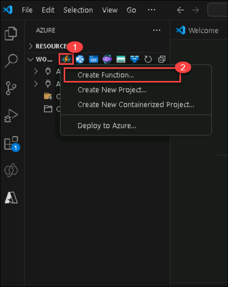
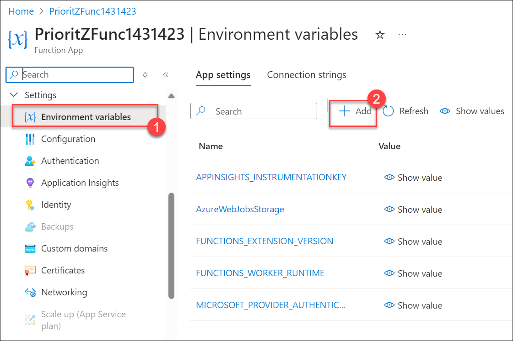
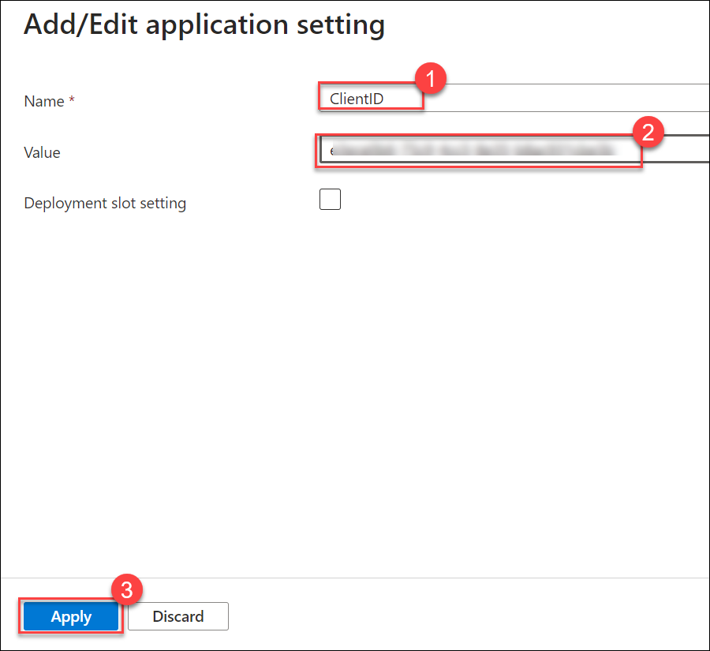
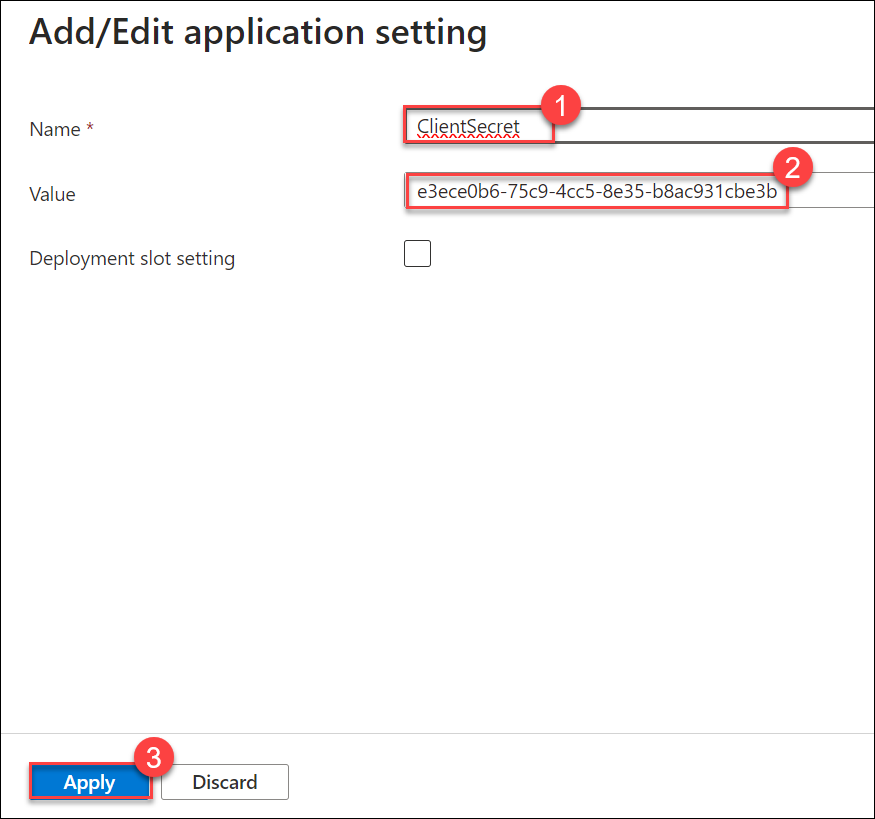
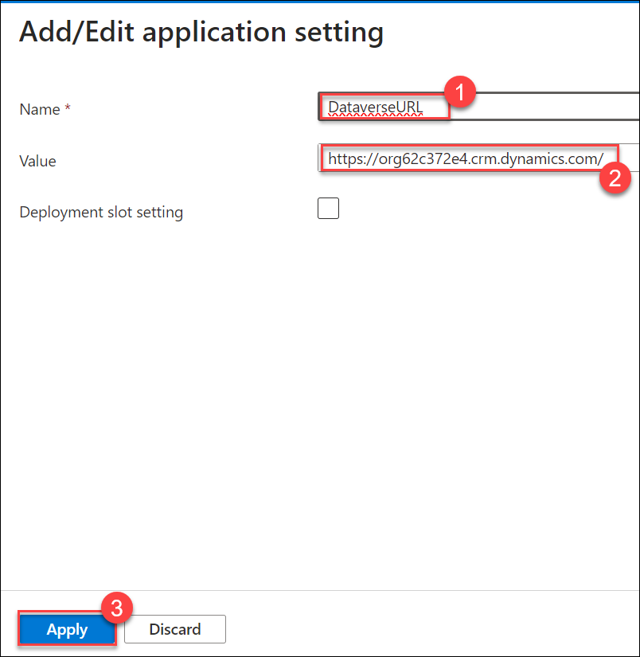

# Laboratório 04 - Função Azure

## Duração estimada: 110 minutos

Trabalhando como parte da equipa de fusão PrioritZ, irá configurar um conector personalizado para uma nova API que
construir utilizando Funções Azure. A equipa decidiu mover a lógica quando um utilizador cria um novo “pedir” para
a API de Função Azure. Isto manterá a fórmula de Aplicação Power simples e permitirá que a lógica mais complexa seja
adicionado no futuro. Neste laboratório, irá criar a função, utilizar a API Dataverse e proteger a API com
O Microsoft Entra ID configura um conector personalizado para utilizar a API e altera a aplicação Power para utilizar o
conector.

Nota: Este laboratório requer uma subscrição (ou ensaio) do Azure no mesmo inquilino que o seu Dataverse
ambiente.

## Objectivo de laboratório

- Exercício 1: Criar Função Azure
- Exercício 2: implementação de funções
- Exercício 3: Publicar a Azure
- Exercício 4: Crie Conector
- Exercício 5: Utilize a função da aplicação em tela

## Exercício 1 – Criar Função Azure

Neste exercício, instala a extensão de ferramentas Azure para o Visual Studio Code e cria a função

### Tarefa 1: Instalar a extensão das ferramentas de azure

1. Iniciar **Código do estúdio do Visual** utilizando o atalho disponível na área de trabalho.

    

2. Selecione o separador **Extensões**.

    

3. Pesquise por **Tais ferramentas de azure (1)** e clique em **Instale (2)** para instalar a extensão Azure Tools.

    

4. Aguarde que a instalação seja concluída.

5. Agora deve ver a nova extensão Azure Tools que adicionou.

    .png)

6. Clique em **Terminal** no menu superior e selecione **Novo Terminal**.

7. Execute o comando abaixo no terminal para criar uma nova pasta.
 
    ```
    md ContosoFunctions
    ```
    .png)

### Tarefa 2: Crie uma função

1. Selecione **Ferramentas de azulo (1)** do menu de navegação esquerda e navegue até à secção **Workspace (2)**.

    

1. Clique no **símbolo(1)** na image, na secção **Workspace**, clique em **Criar Função (2)** e clique em **Criar Novo Projeto**.

    

    >**Nota**: Se o símbolo **+** não for visível, seleccione as definições e veja se existem alguma atualização necessária para o vscode e atualize a aplicação Feche o vscode atual e abra novamente e execute o passo acima.

1. Selecione a pasta **ContosoFunctions (1)** que criou e clique em **selecionar a pasta (2)**

    

1. Agora, será apresentado com o pop-up abaixo, clique em **Sim** para criar um novo projeto.

    

1. Selecione **C#** para a linguagem.

    

1. Selecione **.NET 6.0 LTS** para o tempo de execução . NET.

    

1. Selecione **Acréscimo HTTP com OpenAPI** para o modelo.

    

1. Introduza **CreateTopic** para o nome da função e bate **[ENTER].**

    .png)

1. Introduza **Contoso.PrioritZ** para namespace e hit **[ENTER]**.

    

1. Selecione **Anónimo** para AccessRights. Mais tarde, protegeremos a função utilizando o Microsoft Entra ID.

    

9. Se for apresentado à janela abaixo, selecione **Aberto na janela atual.**

    .png)

1. A sua função deve abrir em **Visual Studio Code**.

1. Se obteve um pop-up **Confia em autores dos ficheiros nesta pasta**, clique em **Sim, confio no autor**

1. Clique em **Terminal** no menu superior e selecione **Enfir Build Task**.

    .png)

1. Assim que a construção for sucedida, **prima qualquer tecla para fechar o terminal**.

    


## Exercício 2 - Implementação de funções

Neste exercício, irá implementar a função.

### Tarefa 1: Função de implementação

1. Clique em **Novo ficheiro** que está próximo de **ContosoFunctions** para adicionar um novo ficheiro.

    .png)

2. Refira o novo ficheiro **Model.cs**

    

3. Abra o novo ficheiro **Model.cs** e cole o código abaixo. Isto definirá os dados que serão enviados
 da aplicação de energia.

    ```
    using System;
    using Microsoft.Azure.WebJobs.Extensions.OpenApi.Core.Attributes;
    using Microsoft.OpenApi.Models;
    namespace Contoso.PrioritZ
    {
    public class TopicItemModel
    {
    public string Choice { get; set; }
    public string Photo { get; set; }
    }
    public class TopicModel
    {
    [OpenApiProperty(Nullable = false, Description = "This is a topic")]
    public string Topic { get; set; }
    public string Details { get; set; }
    public DateTime RespondBy { get; set; }
    public string MyNotes { get; set; }
    public string Photo { get; set; }
    public TopicItemModel[] Choices {get;set;}
    }
    }
    ```

    Depois de adicionar o código, o seu **Model.cs** parecerá a captura de ecrã abaixo:

    

4. Abra o ficheiro **CreateTopic.cs**.

5. Localize os atributos do método Executar (números de linha 24-27) que estão presentes acima do método **Run** e substitua-os pelos atributos abaixo. Isto fornece nomes fáceis de utilizar quando criamos um conector para utilizar a API.


    ```
    [FunctionName("CreateTopic")]
    [OpenApiOperation(operationId: "CreateTopic", tags: new[] { "name" }, Summary = "Create Topic", Description = "Create Topic", Visibility = OpenApiVisibilityType.Important)]
    [OpenApiSecurity("function_key", SecuritySchemeType.ApiKey, Name = "code", In = OpenApiSecurityLocationType.Query)]
    [OpenApiResponseWithBody(statusCode: HttpStatusCode.OK, contentType: "application/json", bodyType: typeof(Guid), Description = "The Guid response")]
    [OpenApiRequestBody(contentType: "application/json", bodyType: typeof(TopicModel))]
    ```

    Depois de adicionar os atributos, o seu método **Run** deve parecer-se com a captura de ecrã abaixo:

    .png)

6. Remova **get** do método Run como deve ter apenas **post**.

    .png)

7. Clique em **Terminal** no menu superior e selecione o **Novo Terminal**.

8. Execute o comando abaixo no terminal para adicionar o pacote **Power Platform Dataverse Client**.

    ```
    dotnet add package Microsoft.PowerPlatform.Dataverse.Client
    ```

    .png)

9. Aguarde que o pacote seja adicionado e execute o comando abaixo para adicionar o pacote **Azure Identity**.

    ```
    dotnet add package Azure.Identity
    ```

10. Aguarde o pacote **Azure Identity** a adicionar.

11. Abra o ficheiro **CreateTopic** e adicione as instruções abaixo após a linha número 11.

    ```
    using System;
    using Microsoft.Identity.Client;
    using Azure.Core;
    using Azure.Identity;
    using Microsoft.PowerPlatform.Dataverse.Client;
    using Microsoft.Azure.WebJobs.Extensions.OpenApi.Core.Enums;
    using Microsoft.Xrm.Sdk;
    ```

    

12. Adicione o método abaixo após o método **Run**. Este método utilizará o token passado do aplicação de chamadas para obter um novo token que permita que a função utilize a API Dataverse em nome de o utilizador chamada.

    ```
    public static async Task<string> GetAccessTokenAsync(HttpRequest req,string resourceUri)
    {
    //Get the calling user token from the request to use as UserAssertion
    var headers = req.Headers;
    var token = string.Empty;
    if (headers.TryGetValue("Authorization", out var authHeader))
    {
    if (authHeader[0].StartsWith("Bearer "))
    {
    token = authHeader[0].Substring(7, authHeader[0].Length -
    7);
    }
    }
    string[] scopes = new[] {$"{resourceUri}/.default" };
    string clientSecret = Environment.GetEnvironmentVariable("ClientSecret");
    string clientId = Environment.GetEnvironmentVariable("ClientID");
    string tenantId = Environment.GetEnvironmentVariable("TenantID");
    var app = ConfidentialClientApplicationBuilder.Create(clientId)
    .WithClientSecret(clientSecret)
    .WithAuthority($"https://login.microsoftonline.com/{tenantId}")
    .Build();
    //Get On Behalf Of Token for calling user
    UserAssertion userAssertion = new UserAssertion(token);
    var result = await app.AcquireTokenOnBehalfOf(scopes,
    userAssertion).ExecuteAsync();

    return result.AccessToken;
    }
    ```

    

13. Substitua o código dentro do método **Run** pelo código abaixo. Isto fornecerá uma instância do API Dataverse e utilize a função GetAccessToken que acabamos de definir.

    ```    
    _logger.LogInformation("Starting Create Topic");
    var serviceClient = new ServiceClient(
    instanceUrl: new Uri(Environment.GetEnvironmentVariable("DataverseUrl")),
    tokenProviderFunction: async uri => { return await
    GetAccessTokenAsync(req, Environment.GetEnvironmentVariable("DataverseUrl"));
    },
    useUniqueInstance: true,
    logger: _logger);
    if (!serviceClient.IsReady)
    {
    throw new Exception("Authentication Failed!");
    }
    ```

    

14. Adicione o seguinte código após a instrução if do método **Run** para reserizar o pedido. Isto levará os dados passados ​​do chamador.

    ```
    string requestBody = await new StreamReader(req.Body).ReadToEndAsync();
    var data = JsonConvert.DeserializeObject<TopicModel>(requestBody);
    ```

    

15. Adicione o código abaixo que cria a linha ao método **Run** após o código que adicionou no passo anterior para **reserializar o pedido**. Este código cria as linhas em Dataverse é onde podemos adicionar mais lógica no futuro.

    ```
    var ask = new Entity("contoso_prioritztopic");
    ask["contoso_topic"] = data.Topic;
    ask["contoso_details"] = data.Details;
    ask["contoso_mynotes"] = data.MyNotes;
    ask["contoso_respondby"] = data.RespondBy.Date;
    if (data.Photo != null)
    {
    // Remove unnecessary double quotes,
    // Remove everything before the first comma (embedded stuff)
    ask["contoso_photo"] = Convert.FromBase64String(data.Photo.Trim('\"').Split(',')[1]);
    }
    var topicId = await serviceClient.CreateAsync(ask);
    foreach (var choice in data.Choices)
    {
    var item = new Entity("contoso_prioritztopicitem");
    item["contoso_choice"] = choice.Choice;
    item["contoso_prioritztopic"] = new
    EntityReference("contoso_prioritztopic", topicId);
    if (choice.Photo != null)
    {
    item["contoso_photo"] =
    Convert.FromBase64String(choice.Photo.Trim('\"').Split(',')[1]);
    }
    var choiceId = await serviceClient.CreateAsync(item);
    }
    ```

    

16. Adicione o código abaixo ao método **Run** para devolver o ID do tópico como JSON (obrigatório por Apps Power) após o código que adicionou no passo anterior para criar a linha ao método **Run**.

    ```
    return new OkObjectResult(topicId);
    ```

    

17. Clique em **Terminal (1)** e seleccione **Entrar a Tarefa de Construção (2)**.

    

18. A corrida deve ter sucesso. Pressione qualquer chave para parar.

    > **Nota**:

    1. Se a operação da tarefa de construção falhar com os erros, certifique-se de que seguiu as instruções anteriores e adicionou o código corretamente nos ficheiros **CreateTopic.cs e Model.cs.**
    
    2. Além disso, pode encontrar os ficheiros **CreateTopic.cs e Model.cs** na localização **C:\LabFiles**, pode comparar o seu código com estes ficheiros e corrigir os problemas se houver algum e tentar realize **passo 17 novamente**.

## Exercício 3 – Publicar a Azure

Neste exercício, irá implementar a função no Azure.

### Tarefa 1: Publicar

1. Selecione **Ferramentas de azulo** do menu do lado esquerdo.

    

2. Clique em **Inscreva-se na secção Azure** na secção **Recursos**.

    

3. Conclua o processo **Sign-in** utilizando as credenciais abaixo.

    * E-mail/nome de utilizador: <inject key="AzureAdUserEmail"></inject>
    
    * Palavra-passe: <inject key="AzureAdUserPassword"></inject>

4. Feche a janela do browser de registo assim que o processo de registo estiver concluído.

5. Navegue de volta para o Código do Visual Studio e clique em **+** que está ao lado do seu separador **Recursos** para criar uma nova aplicação de funções.

    

6. Agora, pesquise e seleccione **Criar Aplicação de Função no Azure**.

    

7. Introduza **PrioritZFunc<inject key="Deployment ID" activityCopy="false" />** para o nome da aplicação de função e hit [ENTER].

    

8. Selecione **.NET 6(LTS) Em processo**.

    

9. Selecione a localização: **<inject key="Region" activityCopy="false" />** da lista e aguarde que a aplicação Função seja implementada.

    

10. Depois de a aplicação Função estar implantada, Clique em **Deploy to Azure** na secção **Workspaces** e escolha a Aplicação de Função que criou.

    

    

11. Aguarde que a aplicação de função seja implementada e navegue até ao Portal Azure utilizando o URL abaixo.

    ```
    https://portal.azure.com/
    ```

12. Selecione **Todos os recursos**, pesquise pela aplicação de função **PrioritZFunc<inject key="Deployment ID" activãoCopy="false" />** que implantou anteriormente e clicar para o abrir.

    

13. Selecione **Autenticação (1)** do menu do lado esquerdo e clique em **Adicionar o fornecedor de identidade (2)**.

    

14. Selecione **Microsoft** para o fornecedor de identidade e **Rendeiro atual - Inquilino único** para **Tipos de conta suportados** e clique em **Adicionar**.

    

15. Abra o menu **Portal** clicando no ícone do menu Portal.

    

16. Selecione **Microsoft Entra ID** na lista de recursos.

    

17. Selecione **App Insuficiências** em **Gersão** do menu do lado esquerdo.

    

18. Clique para abrir o **PrioritZFunc<inject key="Deployment ID" enableCopy="false" />** para abrir a aplicação.

    

19. Copie o **Aplicação (cliente) ID** do **PrioritZFunc<inject key="Deployment ID" activityCopy="false" />** inscrição da aplicação e guarde-o num
 nota como **ID da aplicação API PrioritZFL**. Vai precisar deste ID em passos futuros. Este ID será utilizado para configurar a proteção da API.

    .png)

    .png)

    >**Nota**: Certifique-se de que copia e colide o valor correto **Aplicação (cliente) ID**. Copiar o valor incorreto resultará em problemas nos próximos passos/tarefas.

20. Copie o **Directory (inquilino) ID** ae mantenha-o num bloco de notas como **Dirent ID**. Vai precisar deste ID em
 passos futuros.

    .png)

    >**Nota**: Certifique-se de que copia e colide o valor correto de **Directory (inquilino) ID**. Copiar o valor incorreto resultará em problemas nos próximos passos/tarefas.

21. Selecione **Certificados e segredos** em **Gringe** no menu do lado esquerdo.

    

22. Clique em **+ Novo segredo do cliente**.

    .png)

23. Forneça uma descrição como **PrioritZ API secret (1)**, seleccione **3 meses (2)** e clique em **Adicionar (3)**.

    

24. Copie o **Value** e mantenha-o num bloco de notas como **PrioritZFL API Secret**. Precisa desse valor em passos futuros.

    >**Nota**: Certifique-se de que copia e colhe o valor correto **Secreto**. Copiar o valor incorreto resultará em problemas nos próximos passos/tarefas.

25. Selecione **permissões da API** em **Gersão** do menu do lado esquerdo.

    

26. Clique em **+ Adicione uma permissão**.

    .png)

27. Selecione **Dynamics CRM** na lista de permissões da API. Dynamics CRM é Dataverse, o portal Azure simplesmente não foi atualizado no momento da escrita dessas etapas.

    

28. Verifique a caixa de selecção **user_impersonation** e clique em **Adicionar permissão**.

29. Volte a **Home** e abra o **PrioritZFunc<inject key="Deployment ID" activityCopy="false" />** a aplicação de função.

    

30. Selecione **Variáveis ​​de ambiente (1)** em **Definições** do menu do lado esquerdo..

31. Clique em **+ Adicionar (2)**

    

32. Introduza os seguintes detalhes sobre a **Adicionar/Editar a definição de aplicação** lâmina e clique em **Aplicar (3)**.

    - **Nome**: **ClientID (1)**
    
    - **Value**: Colar o **ID** da aplicação API **PrioritZFL (2)** que notou anteriormente no bloco de notas.

        

33. Clique novamente em **+ Adicionar**.

34. Introduza os seguintes detalhes sobre a **Adicionar/Editar a configuração da aplicação** lâmina e clique em **Aplicar (3)**.

    - **Nome**: **ClientSecret (1)**
    
    - **Value**: Colar o **PrioritZFL API Secret (2)** que notou anteriormente no bloco de notas.

        

35. Clique novamente em **+ Adicionar**.

36. Introduza os seguintes detalhes sobre a **Adicionar/Editar a configuração da aplicação** lâmina e clique em **Aplicar (3)**.

    - **Nome**: **TennantID (1)**
    
    - **Value**: Colar o **TenantID (2)** que notou anteriormente no bloco de notas.

        

37. Inicie uma nova janela ou tablaça de navegação no centro de administração Power Platform e selecione **Ambientes**.

    ```
    https://admin.powerplatform.microsoft.com/environments
    ```

38. Clique para abrir o ambiente Dev denominado **DEV_ENV_<inject key="Deployment ID" activityCopy="false" />** está a utilizar para este laboratório.

39. Copie o **URL** Ambiente e cole-o no bloco de notas.

    .png)

40. Clique em **+ Adicione** mais uma vez.

41. Introduza os seguintes detalhes sobre a **Adicionar/Editar a definição de aplicação** lâmina e clique em **Aplicar**.

    - **Nome**: **DataverseURL**
    - **Value**: Colar o **URL Ambiente** que notou anteriormente no bloco de notas.

        

      >**Nota**: Certifique-se de que colide o **URL do ambiente** que observou anteriormente nesta tarefa. Copiar o valor incorreto resultará em problemas nos próximos passos/tarefas.

42. Deve ver as quatro definições de aplicação que adicionou.

    .png)

43. Clique em **Aplicar** e In **Guardar alterações** pop-up clique em **Confirmar**.

44. Colar o URL abaixo no Notepad e substitua `{tennant id}` e `{api application id}` por **rend id** e **PrioritZFL API da aplicação ID** dos seus valores do seu
 bloco de notas.

    ```
    https://login.microsoftonline.com/{tenant-id}/adminconsent?client_id={api app id}
    ```

    Depois de atualizar os valores, o seu URL deve ficar assim: `https://login.microsoftonline.com/2140cxxxxxxx/adminconsent?client_id=195b2axxxxxxx`

45. Após atualizar os valores, navegue até ao URL num separador de browser e inscreva-se com as credenciais abaixo.

    * E-mail/nome de utilizador: <inject key="AzureAdUserEmail"></inject>
    * Palavra-passe: <inject key="AzureAdUserPassword"></inject>

53. Clique em **Aceite**.

### Tarefa 2: Registe-se a aplicação do cliente do conector

1. Navegue até ao portal Azure e pesquise por **Microsoft Entra ID** ***(1)*** na barra de pesquisa e seleccione **Microsoft Entra ID** ***(2)*** de as sugestões.

    

1. Selecione **App Insuficiências** ***(1)*** da lâmina lateral e clique em **+ Novo registo** ***(2)***. Este registo de aplicação será utilizado para o conector para aceder à API protegida.

    

1. Forneça os seguintes detalhes e clique em **Registar** ***(5)***.

    - Nome: **PrioritZConnector<inject key="DeploymentID" enableCopy="false" />** ***(1)***
    - Tipos de contas suportados: **Apenas contas neste diretório organizacional (apenas TenantName - Inquilino único)** ***(2)***
    - Redirecionar URL: Selecione **Web** ***(3)*** e forneça `https://global.consent.azure-apim.net/redirect` ***(4)*** como o URL .

        

1. Copie o **Application (cliente) ID** e guarde-o num bloco de notas como **PrioritZ Connector Application ID**.

    

1. Selecione **Certificados e segredos** na lâmina lateral e clique em **+ Novo segredo do cliente**.

    

1. Fornecer **PrioritZsecret** ***(1)*** como descrição, defina expiração para **3 meses** ***(2)***, e clique em **Adicionar** ***(3)***.

    

1. Copie o **Valor Secreto** e guarde-o num bloco de notas como **PrioritZ Connector secert**.

    

1. Selecione **permissões API** ***(1)*** da lâmina lateral e clique em **+ Adicione uma permissão** ***(2)***.

    

1. No separador Permissão de API de pedido, seleccione o separador **As minhas APIs** ***(1)*** e seleccione **PrioritZFunc<inject key="DeploymentID" enableCopy="false" />** ***(2)***.

    

1. Toggle a caixa de selecção **user_impersonation** ***(1)*** e clique em **Adicionar permissão** ***(2)***.

    

## Exercício 4 – Crie Conector

Neste exercício, criará um novo conector personalizado.

### Tarefa 1: Crie um conector

1. Navegue até ao Portal Azure utilizando o URL abaixo.

    ```
    https://portal.azure.com/
    ```

1. Agora no portal Azure, clique em **Grupos de recursos** presentes em Navegate.

    

1. Selecione o **prioritzfunc<inject key="DeploymentID" activityCopy="false" />** Recurso Grupo da lista.

    

1. Seleccione **PrioritZFunc<inject key="DeploymentID" activityCopy="false" />** recurso de função da lista.

    

1. Na página de visão geral, Copie o **URL** da função.

    

1. Adicione **/api/swagger.json** no final do URL e aceda a ele utilizando o browser.

    .png)

    >**Nota**: Se as permissões surgirem, clique em **Aceite** e continue.

1. Clique com o botão direito do rato no swagger seleccione **Guarrear as** e Guardar o ficheiro na máquina local: Forneça um nome para ficheiro como swag.json.

    

1. Navegue até ao portal do fabricante de aplicações de energia utilizando o URL abaixo. Certifique-se de que o ambiente de desenvolvimento é selecionado.
 
    ```
    https://make.powerapps.com
    ```

1. Expandir **Dataverse** ***(1)*** e seleccione **Conectores personalizados** ***(1)***.

    

1. Clique no botão chevron junto ao Novo conector personalizado e selecione **Importar um ficheiro OpenAPI**.

    

1. Introduza **Conector PrioritZ** ***(1)*** para nome e clique em **Importar** ***(2)***.

    

1. Selecione o ficheiro **swagger (1)** que guardou no passo 7 desta tarefa e clique em **Continuar (2)**.

    

1. Fornecer **PrioritZ<inject key="DeploymentID" activityCopy="false" /> Conector** ***(1)*** como descrição como e clique em **Segurança** ***(2)***.

    

16. Selecione **OAuth 2.0** ***(1)*** para o tipo de autenticação. Forneça os seguintes detalhes e clique em **Criar conector** ***(8)***.

    - Fornecedor de identidade: **Azure Active Directory** ***(2)***
    - ID do cliente: Colar **ID da aplicação do conector PrioritZ** ***(3)*** que copiou anteriormente
    - Segredo do cliente: Colar **PrioritZ Connector Secret** ***(4)*** que copiou anteriormente
    - ID do inquilino: Colar o **ID do inquilino** ***(5)*** que copiou anteriormente
    - URL de recursos: Colar **ID da aplicação API PrioritZ** ***(6)*** que copiou anteriormente
    - Ativar o login em nome: **true** ***(7)***

        

### Tarefa 2: Conector de teste

1. Agora navegue até ao conector que acabou de criar e clique no botão **edit**. Selecione o separador **Test** ***(1)*** no menu suspenso e clique em **+ Nova ligação** ***(2)***.

    

1. Clique em **Criar**.

    

1. Se o prompt de login aparecer entre nas credenciais abaixo e clicar em **Aceite** para aceitar os termos.

    * E-mail/nome de utilizador: <inject key="AzureAdUserEmail"></inject>
    * Palavra-passe: <inject key="AzureAdUserPassword"></inject>

7. Depois de criado o conector, selecione **Conectores personalizados (1)** no menu do lado esquerdo e clique em **Editar (2)** no **Conector PrioritZ**.

    

7. Selecione o **Teste** no separador menu suspenso.

    

9. Certifique-se de que a ligação que criou está selecionada.

    

11. Ligue **Raw Body** e forneça o JSON abaixo e clique em **Teste operar**.

    ```
    {
    "topic": "Test Topic",
    "details": "From Azure Function",
    "respondBy": "2022-11-01",
    "myNotes": "It worked",
    "choices": [
    {
    "choice": "Choice 1"
    }
    ]
    }
    ```
    
    

11. O teste de operação deve ter sucesso e a resposta deve parecer a image abaixo.

    .png)

### Exercício 5 – Utilize a função de aplicação em tela

Neste exercício, irá utilizar a função Azure que criou através do conector personalizado do PrioritZ
Aplicação em tela de administrador.

### Tarefa 1: Utilize a função

1. Navegue até ao portal do fabricante do Power Apps e certifique-se de que está no ambiente correto.
2. Selecione Aplicações, selecione a aplicação **PrioritZ Admin** e clique em **Editar**.

    .png)

3. Selecione **Data** , clique em **+ Adicionar dados**, pesquise por conector prioritz e selecione o **Conector PrioritZ**
 criou.

    .png)

4. Adicione o conector clicando nele novamente.
5. Clique no botão **... Mais ações** do conector que acabou de adicionar e seleccionar **Renomear**.

    .png)

6. Renomeie o conector **PrioritZFunction**.

    .png)

7. Selecione a **Árvore ver** e expanda o **Add Tópico Ecrã**.

    

9. Selecione o **Adicionar ícone de escolha**.

    .png)

9. Substitua a fórmula **OnSelect** do **Adicionar ícone de escolha** com a fórmula abaixo. Isto ajusta o
 nomes de colunas para corresponder à API e codifica as fotos.

    .png)

    ```    
    Collect(
    colAddChoices,
    {
    choice: 'Choice name textbox'.Text,
    photoRaw: UploadedImage1.Image,
    photo: JSON(
    UploadedImage1.Image,
    JSONFormat.IncludeBinaryData
    )
    }
    );
    Reset('Choice name textbox');
    Reset(AddMediaButton2)
    ```

10. Selecione **Guardar ícone do tópico**.

11. Substitua a fórmula **OnSelect** do **Guardar o ícone do tópico** com a fórmula abaixo. Isto muda para
 fazer com que a API crie o “pergunte”.


    .png)

    ```    
    Set(returnGuid, PrioritZFunction.CreateTopic({
    topic: 'Topic name textbox'.Text,
    details: 'Topic details textbox'.Text,
    respondBy: 'respond by date picker'.SelectedDate,
    myNotes: 'Notes textbox'.Text,
    photo: JSON(AddTopicImage.Image, JSONFormat.IncludeBinaryData),
    choices: ShowColumns(colAddChoices, "choice", "photo")
    }));
    Notify("Topic created! " & returnGuid, NotificationType.Success, 5000);
    Back();
    ```

12. Clique em **Guardar**.

1. Clique em **Publique**.

1. Selecione **Publique esta versão** e aguarde que a publicação seja concluída.

1. Não navegue por esta página.

### Tarefa 2: Aplicação de teste

1. Selecione o **Ecrã Esclareza** e clique em **Própria a aplicação**.

    .png)

2. Clique no botão **+** adicionar.
3. Introduza **Teste de Função** para o Tópico, **Testando a função** para Detalhes. **Nota para testar a função** para
 Note que selecione uma data para Resposta por e clique em **Adicione uma image**.

    .png)

4. Navegue para este caminho **C:\LabFiles** no ficheiro explorador de ficheiros, seleccione **image.png** e clique em abrir.

5. Introduza **Escolha de teste um** para Escolha e clique em **adicionar uma image**.
6. Navegue para este caminho **C:\LabFiles** no ficheiro explorer, seleccione **image.png** e clique em **+**.

    .png)

7. Introduza **Teste de escolha duas** para Escolha e clique em **adicionar uma image**.

8. Navegue para este caminho **C:\LabFiles** no ficheiro explorer, seleccione **image.png** e clique em **+**.

9. Clique em **Guardar**.

    .png)

10. O novo tópico deve ser guardado e deve ser navegado de volta para o ecrã principal.
11. Localize o novo tópico que criou e abra.

    

12. Deve ver as duas opções que adicionou ao tópico.

    

## Resumo

Neste laboratório, aprendeu a criar, implementar e publicar uma Função Azure, criar um conector para ele e testar a sua integração nas aplicações Power Platform.

## Concluiu o laboratório com sucesso
