# Laboratório 04 - Gestão do ciclo de vida da aplicação

## Duração estimada: 90 minutos

Trabalhando como parte da equipa de fusão PrioritZ, estará a configurar a GitHub Actions com as ferramentas de construção de plataformas Power para automatizar e agilizar as implementações da equipa. Isto envolve a configuração da integração contínua e dos pipelines de implementação contínua (CI/CD) para garantir a entrega perfeita e eficiente de atualizações nas aplicações Power Platform, ao mesmo tempo que gere os processos de controlo, teste e implementação de versão para melhorar a colaboração e manter padrões de alta qualidade em todo o projetos da equipa.

Objectivos de laboratório

- Exercício 1: Configure um Diretor de Serviço
- Exercício 2: Crie o GitHub Repo
- Exercício 3: Exportação e Filial
- Exercício 4: Lançamento para Teste

## Exercício 1 – Configure um Diretor de Serviço

Neste exercício, criará um diretor de serviço. O diretor de serviço será utilizado pelo fluxo de trabalho
ações, para que não sejam executadas sob a sua identidade individual do utilizador.

### Tarefa 1: Criar registo de aplicações

1. Navegue de volta ao separador do navegador em que o Portal Azure está aberto. Se ainda não estiver aberto, navegue até ao Portal Azure utilizando o URL abaixo.

    ```
    https://portal.azure.com/
    ```

1. Na página inicial do Portal Azure, pesquise por **Microsoft Entra ID** ***(1)*** na barra de pesquisa e seleccione **Microsoft Entra ID** ***(2)*** do sugestões.

    

1. Selecione **App Insuficiências** ***(1)*** da lâmina lateral e clique em **+ Novo registo** ***(2)***. Este registo de aplicação será utilizado para o conector para aceder à API protegida.

    

1. Forneça os seguintes detalhes e clique em **Registar** ***(3)***.

    - Nome: **GitHub Deploy<inject key="DeploymentID" enableCopy="false" />** ***(1)***
    - Tipos de conta suportados: **Apenas contas neste diretório organizacional (OTU WA WA AIW apenas [SUFFIX] - Inquilino único)** ***(2)***

        

1. Copie o **Application (cliente) ID**, **Directory(Tenant) ID** e guarde-o num bloco de notas, pois precisa dele para utilização posterior.

    

1. Selecione **Certificados e segredos** na lâmina lateral e clique em **+ Novo segredo do cliente**.

    

1. Introduza **GitHub client secret<inject key="DeploymentID" enableCopy="false" />** ***(1)*** como descrição, define expiro para **3 meses** ***(2 )*** e clique em **Adicionar** ***(3)***.

    

1. Copie o **valor** e guarde-o num bloco de notas conforme necessário para utilização posterior.

    

    >**Nota**: Certifique-se de que copia e colhe o **Aplicação (cliente) ID**, **Directory(Tenant) ID** e **Secreto** valor. Copiar o valor incorreto resultará em problemas nos próximos passos/tarefas.

### Tarefa 2: Crie um novo Dataverse

Nesta tarefa, irá um novo teste de ambientes Dataverse.

1. Abra uma nova janela ou aba do browser e navegue até ao Power Platform Admin Center utilizando o URL abaixo.

    ```
    https://admin.powerplatform.microsoft.com/environments
    ```

1. Clique em **+Nova** para criar um novo Dataverse.

    

1. No separador **Novo ambiente**.

    - Nome:**DEV_ENV_TEST(1)**.

    - Faça este ambiente gerido:**Ativar Sim(2)**.

    - Grupo:**Nenhum(3)**. e desça.

    - Tipo :**Developer(4)** e clique em **Próximo(5)**.

    - Implementar aplicações e dados de exemplo? :**Ativar Sim(6)** e clique em **Guardar(7)**.

        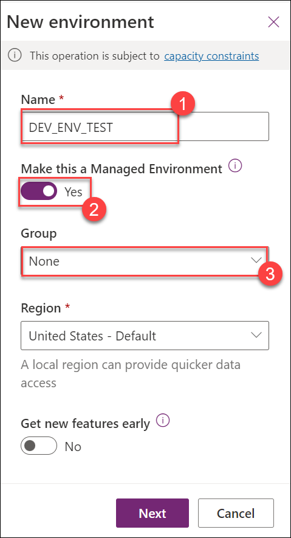

        

        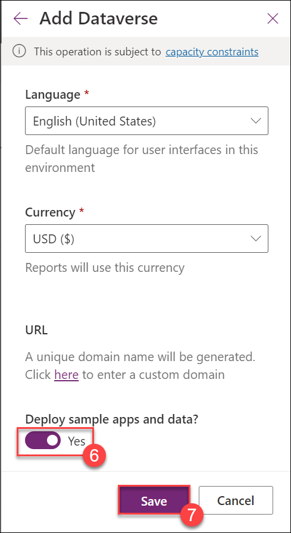

1. Agora pode ver o novo Dataverse, **DEV_ENV_TEST**, que criou.

    

### Tarefa 3: Crie um utilizador de aplicação no Dataverse

Nesta tarefa, irá registar a aplicação que criou no Microsoft Entra ID no programa e teste
Ambientes de Dataverse. Será também atribuído uma função de segurança que permitirá ao diretor do serviço
soluções de implementação.


1. Abra uma nova janela ou aba do browser e navegue até ao Power Platform Admin Center utilizando o URL abaixo.

    ```
    https://admin.powerplatform.microsoft.com/environments
    ```

1. Clique em **Ambientes** ***(1)*** da lâmina lateral e seleccione o seu **DEV_ENV_<inject key="DeploymentID" enableCopy="false" /> o ambiente** ***(2)***.

    

1. Na página do seu ambiente, clique em **Definições**.

    

1. Expandir **Users + permissões** **(1)** e seleccione **Application users** **(2)**.

    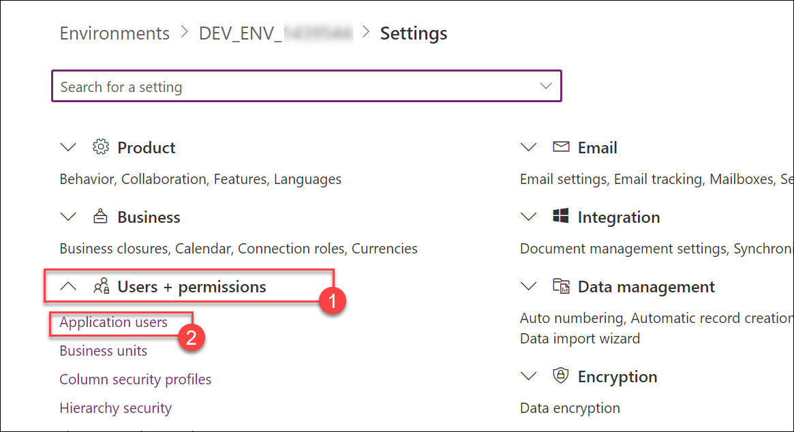

1. Na página utilizadores da aplicação, clique em **+ nova aplicação utilizador**.

    

1. Na guia do utilizador da aplicação, clique em **+ Adicione uma aplicação**.

    

1. Selecione o **GitHub Deploy<inject key="DeploymentID" activityCopy="false" />** ***(1)*** registo de aplicação que criou anteriormente e clique em **Add** **( 2)**.

    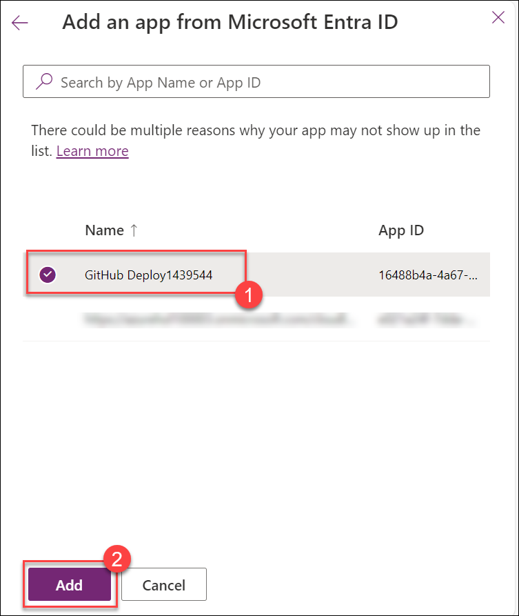

1. Selecione a sua **unidade de negócio** **(1)** dodrop-down e In **Pelas de segurança** clique em **edit símbolo (2)** e seleccione
 **Administrador do sistema(3)** e clique em **Criar (4)**.

    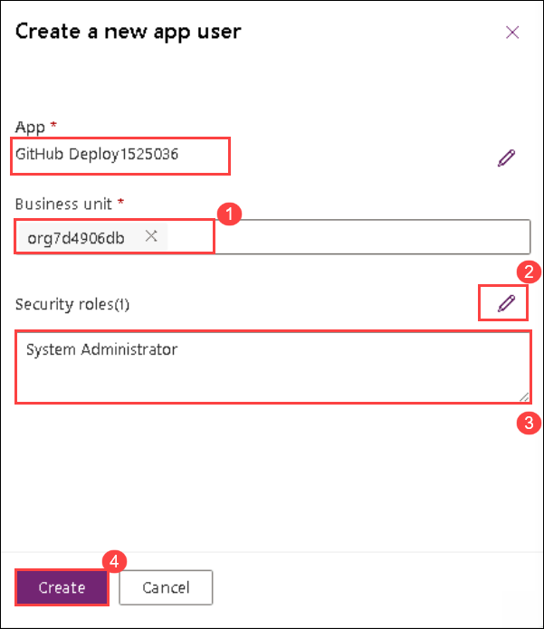

1. Volte a recuar para **Ambientes** ***(1)*** na lâmina lateral e seleccione o seu **teste ambiente** ***(2)***.

    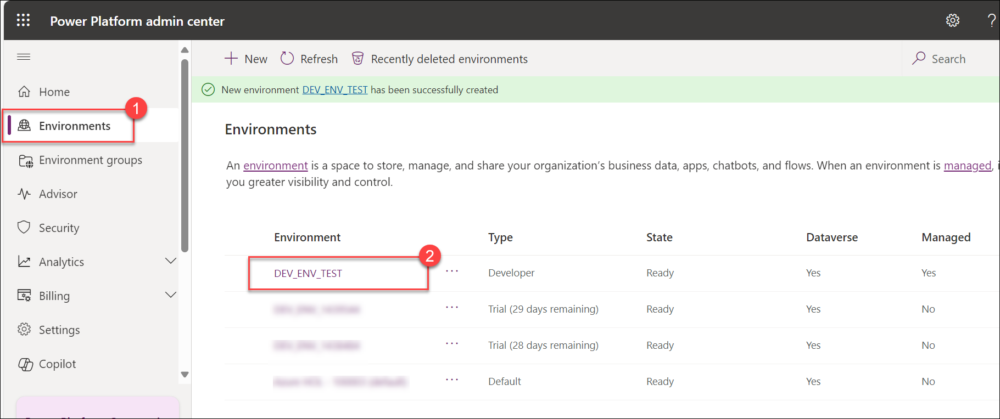

1. Na página de ambiente de teste, clique em **Definições**.

    

1. Expandir **Users + permissões** ***(1)*** e seleccione **Application users** ***(2)***.

    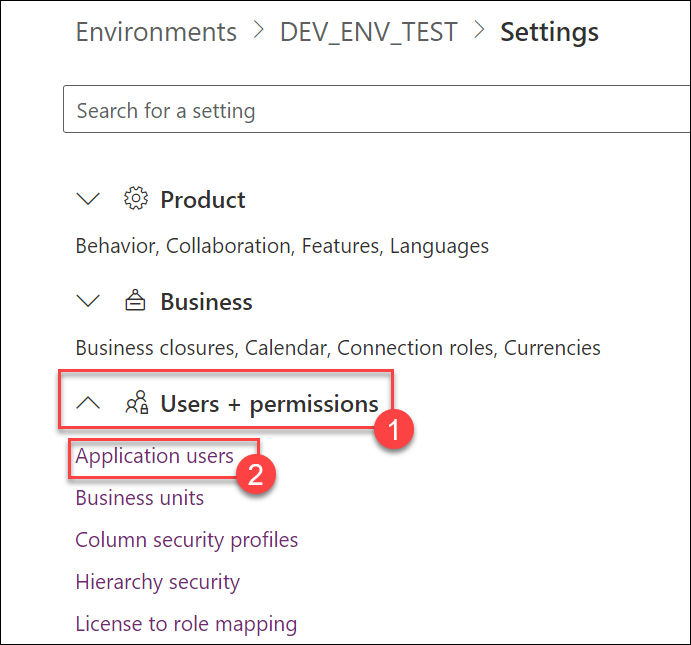

1. Na página utilizadores da aplicação, clique em **+ nova aplicação utilizador**.

    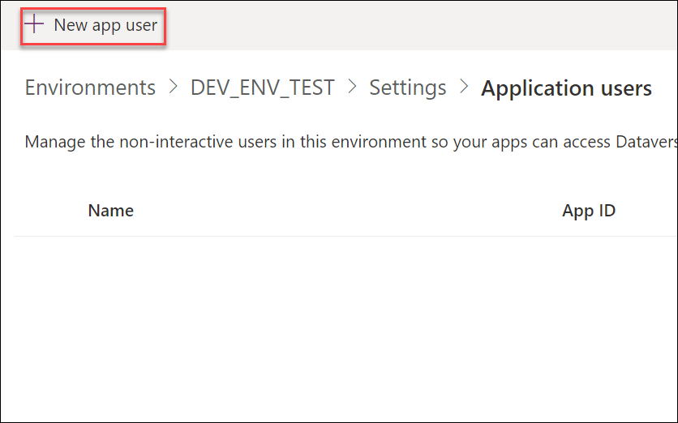

1. No separador **Criar um novo app user**, clique em **+ Adicione uma aplicação**.

    

1. Selecione o **GitHub Deploy<inject key="DeploymentID" activityCopy="false" />** ***(1)*** registo de aplicação que criou anteriormente e clique em **Adicionar** ***(2)***.

    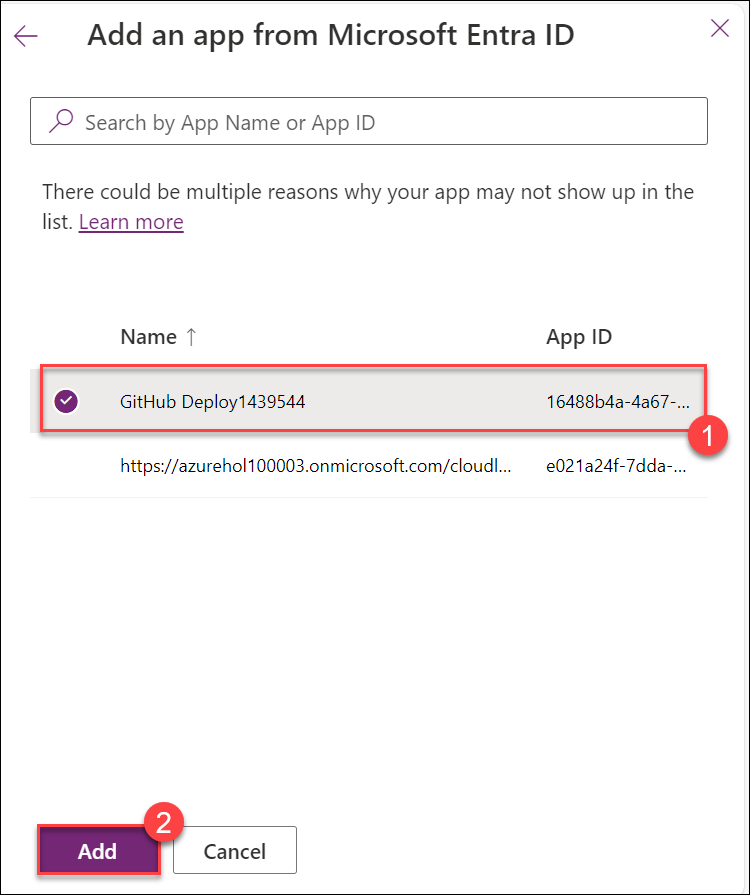

1. Selecione a sua **unidade de negócios** **(1)** do drop-down e In **Propes de segurança** clique em **edit símbolo (2)** e seleccione **Administrador do sistema(3)** e clique em **Criar (4)**.

    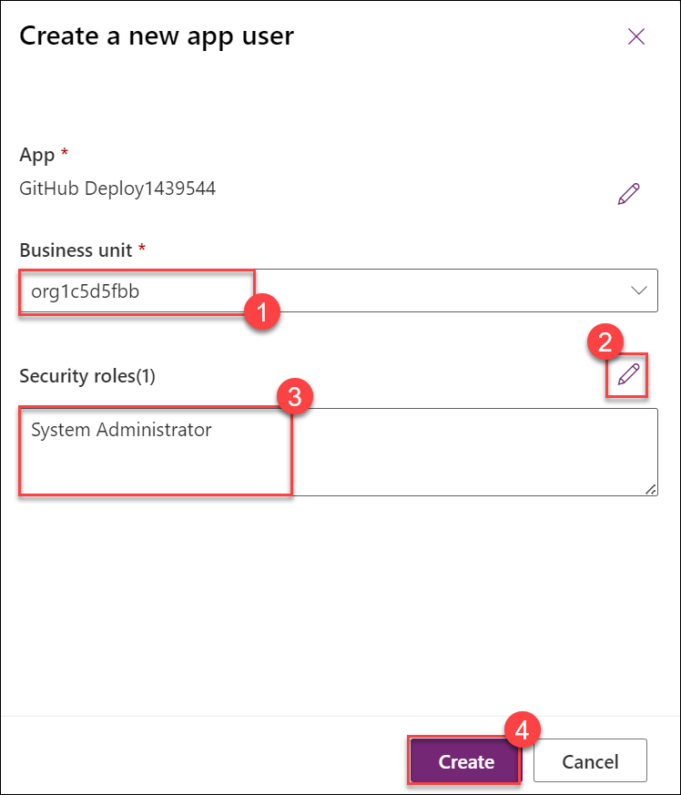

1. Clique em **Ambientes** ***(1)*** da lâmina lateral e seleccione o seu **DEV_ENV_<inject key="DeploymentID" enableCopy="false" /> o ambiente** ***(2)***.

    

1. Copie o **URL** Ambiente e guarde-o num bloco de notas, estará a utilizar este URL em passos futuros.

    

1. Volte a voltar a **Ambientes** ***(1)*** na lâmina lateral e seleccione o seu ambiente **teste(2)**.

    

1. Copie o **URL** Ambiente e guarde-o num bloco de notas, estará a utilizar este URL em passos futuros.

    

## Exercício 2 – Crie o GitHub Repo

Neste exercício, criará um repositório do GitHub e adicionar segredos do repositório.

### Tarefa 1: Crie um repositório

1. Navegue até ao URL abaixo e inscreva-se utilizando as suas credenciais do GitHub.

    ```
    https://github.com/
    ```

1. Clique no ícone do seu perfil e selecione **Os seus repositórios**.

    

3. Clique em **Novo repositório** para criar um repositório.

    

4. Introduza **PrioritZ (1)** para o nome do repositório, seleccione **Public (2)** , verifique o **Adicionar um ficheiro README (3)**.

    

1. Clique em **Criar repositório** para o criar.

    

5. Clique em **Definições** para abrir o separador de definições.

    

6. Aceda à secção **Segurança**, expanda **Segredos e variáveis (1)** e seleccione **Ações (2)**.

    > **Nota:** Os valores que fornece não serão visíveis depois de criar o item, por isso tenha pressa para acertar os valores.

    

7. Clique em **Novo repositório secreto** para adicionar um segredo.

    

8. Introduza **PowerPlatformAppID (1)** para Nome e paste o **Aplicação (cliente) ID (2)** de **GitHub Deploy<inject key="DeploymentID" activityCopy="false" />** que observou anteriormente em **`Exercício 1 -> Tarefa 1 -> Passo 5`** do seu bloco de notas no campo **Value** e clique em **Adicionar secreto (3)**.

    

9. Clique em **Novo repositório secreto** novamente.

10. Introduza **PowerPlatformClientSecret (1)** para Nome e cole o **secreto Valor (2)** do seu bloco de nota que observou anteriormente em **`Eviso 1 -> Task 1 -> Passo 8`** em o campo **Value** e clique em **Adicionar secreto (3)**.

    

11. Clique em **Novo repositório secreto** novamente.

12. Introduza **PowerPlatformTenantID (1)** para Nome e colar o secreto **ID do inquilino (2)** do seu bloco de notas que observou anteriormente em **`Exercise 1 -> Tarefa 1 -> Passo 5`** no campo **Value** e clique em **Adicionar secreto (3)**.

    

13. Clique novamente em **Novo repositório secreto**.

14. Introduza **PowerPlatformDevUrl (1)** para o nome e cole o URL secreto do ambiente **Dev (2)** do seu bloco de nota que copiou no **`Exercise 1 -> Tarefa 3 -> Passo 21`** no campo **Valor** e clique em **Adicionar secreto (3)**.

    >**Nota**: Certifique-se de que está a colar o URL do ambiente de desenvolvimento denominado **DEV_ENV_<inject key="DeploymentID" enableCopy="false" />** que copiou no **`Exercise 1 -> Tarefa 3 -> Passo 17`**

    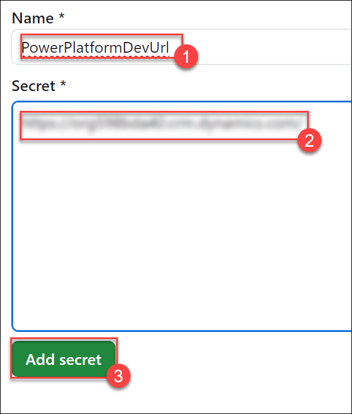

15. Clique em **Novo repositório segredo** mais uma vez.

16. Introduza **PowerPlatformTestUrl (1)** para o nome e cole o **Test Environment URL (2)** do seu bloco de nota que copiou no **`Exercise 1 -> Tarefa 3 -> Passo 18`** no campo **Value** e clique em **Adicionar secreto (3)**.

    >**Nota**: Certifique-se de que está a colar o URL do ambiente de teste denominado **DEV_ENV_TEST** que copiou no **`Exercise 1 -> Tarefa 3 -> Passo 23`**

    

17. Agora deve ter **5** segredos do repositório.

    

18. Não naveguedesta página.

### Exercício 3 – Exportação e Filial

Neste exercício, irá definir uma ação de fluxo de trabalho e adicionar passos que exportem a solução do programa
ambiente e criar um novo ramo.

### Tarefa 1: Exportação e ramo

Nesta tarefa, criará a definição de fluxo de trabalho utilizando o YAML fornecido. A ação YAML utiliza a indentação de dois espaços, por isso siga isso com cuidado à medida que constrói a definição de fluxo de trabalho. Em caso de dúvida, reveja o
indentação mostrada nas images.

1. Selecione o separador **Ações** e clique em **Configurar um fluxo de trabalho sozinho** para criar um novo fluxo de trabalho.

    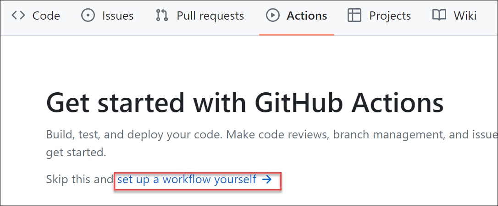

1. Altere o nome do ficheiro **exporte-and-branch.yml**

1. Retire tudo a partir do ficheiro de workflow.

    

1. Navegue até `https://raw.githubusercontent.com/CloudLabsAI-Azure/PowerApps-Dev-in-a-Day/main/export-and-branch.yml` URL, Copie o conteúdo total do ficheiro e paste no fluxo de trabalho **exporte-and-branch.yml**.

    

1. Clique em **Comprometeu a alteração** e clique em **Commit alterar**.

    

    

1. Aceda ao separador **Ações(1)** no lado esquerdo e selecione **General(2)**.

    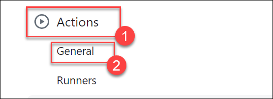

1. Na secção **Permissão do Flowflow**, certifique-se de que **ler e escreva permissão** é seleccionado e clique em **save**.

    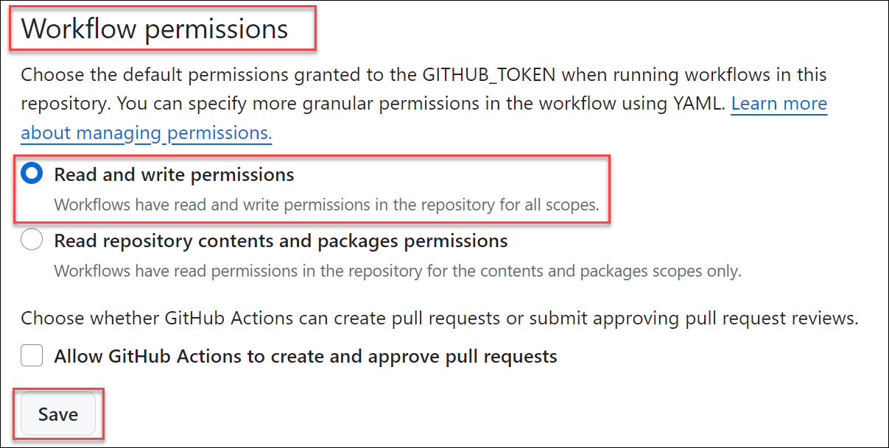

1. Selecione o separador **Ações** **(1)** e selecione o **workflow** ***(2)*** que criou.

    

1. Clique em **Puxe o workflow.**

    

1. Clique em **Fune o fluxo de trabalho** novamente e aguarde que o fluxo de trabalho seja executado para ser concluído.

    

1. Selecione o separador **Código** ***(1)*** e clique em **Filques** ***(2)***. Deverá ver dois ramos

    

1. Clique para abrir a branch que foi criada pela ação de workflow denominada Prioritz-XXXXXXXX.

    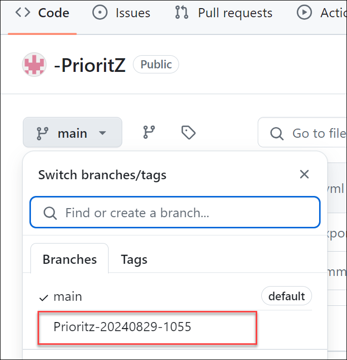

1. No Prioritz-XXXXXXX. ramo, poderá ver a pasta de solução.

    

1. Clique no botão **Contribua** ***(1)*** e seleccione **Abrir o pedido de pull** ***(2)***.

    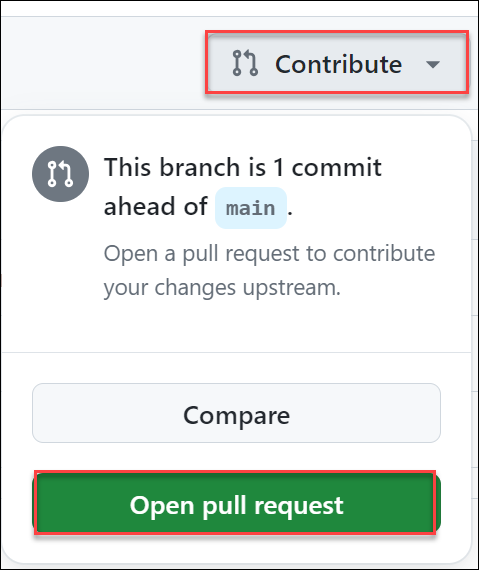

23. Adicione uma descrição se quiser e clique em **Criar pedido de pull**.

    

24. Agora deve ver o resumo do pedido de pull. Confirme que o ramo não tem conflitos com o
 ramo principal e que as alterações podem ser fundidas automaticamente no ramo principal.

25. Clique no botão chevron ao lado do botão **Merge pur recomenda** e selecione **Squash e**
 **merge**.

    

26. Clique em **Absorver e fundir**.

27. Clique em **Confirme a abóbora e a fusão**.

28. O pedido de pull deve ser fundido com sucesso.

    


### Exercício 4 – Lançamento para teste

Neste exercício, criará uma ação de workflow e adicionará passos que libertarão a solução que
exportado para o ambiente de teste.

### Tarefa 1: Crie fluxo de trabalho

1. Agora navegue até ao separador **Ações (1)**.

1. Clique em **Novo fluxo de trabalho (2)**.

    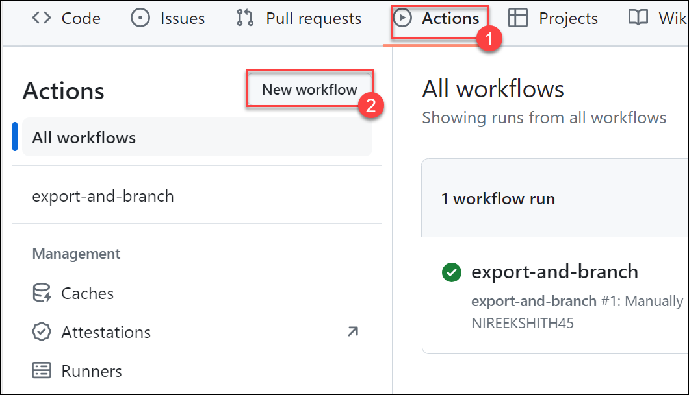

1. Agora, na página de trabalho **Escolha um workflow**, clique em **configurar um fluxo de trabalho sozinho**.

    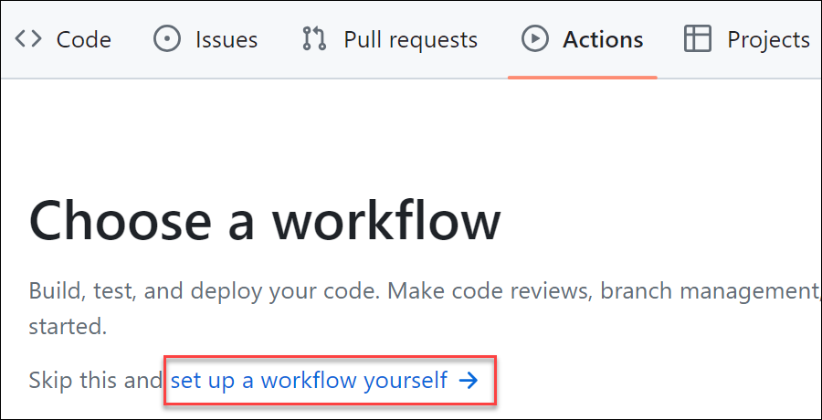

1. Altere o nome do ficheiro para **release-to-test.yml**

    

1. Retire tudo a partir do ficheiro de workflow.

1. Navegue até `https://raw.githubusercontent.com/CloudLabsAI-Azure/PowerApps-Dev-in-a-Day/main/lease-to-test.yml` URL no browser e copie o conteúdo total do fixe e cole-o no ficheiro de trabalho **release-to-test.yml**.

    

16. Clique em **Comprometer alterações** e clique em **Commit alterar**.

    

18. Selecione o separador **Código** e certifique-se de que selecciona Prioritz-XXXXXXX.

    

19. Aceda à secção **Leves** e clique em **Criar nova versão**.

    

20. Clique no botão **Escolher um tag**, introduzir **v1.0.0** e seleccione **+ Criar nova etiqueta na publicação**.

    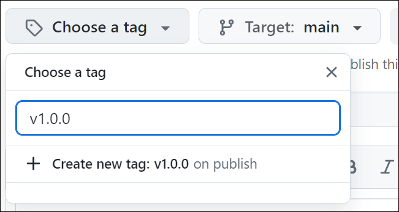

21. Clique em **Publique versão**.

22. Selecione o separador **Ações** e monitorize o fluxo de trabalho.

    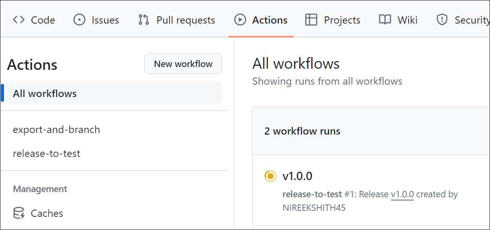

23. O lançamento deve ser concluído com sucesso.

    

24. Navegue de volta ao portal PowerApps e Certifique-se de que está no ambiente de teste PowerApps.

    

25. Selecione o separador **soluções (1)** do lado esquerdo e clique em **Gerito (2)**, deve ver a solução implementada com o
 nome de **Prioritz (3)**.

    

## Resumo
Neste laboratório, aprendeu a promover uma solução para um ambiente de teste, a configurar um diretor de serviço e a gerir a sua solução utilizando o GitHub para controlo de versão e autoinformação.

## Concluiu o laboratório com sucesso
